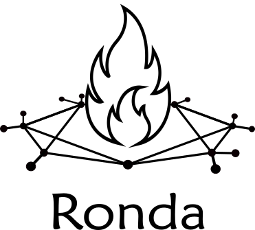

# Ronda de Escritura

<link rel="shortcut icon" type="image/x-icon" href="favicon.ico"> 

[Participá](actividad.md)

## Rondapreguntas - por Manoni

Que es lo que pega la vuelta?  
La ronda se mueve o está quieta?  
En la ronda nos paramos sobre una pata con la mano en el mentón? O bailamos?  
Que es lo que se ve desde el centro?  
Quienes están afuera?  
Que es lo que la ronda tiene que cerrar para abrir la comunicación?  
Vamos a estar a salvo?  
Voy a corregir este texto?  
Que pretendemos de lxs otrxs?  
Murió la intelectualidad?  
Hacemos estantes o tiramos los libros viejos?  
Cuando empezamos a tener pánico digital?  
Con qué nos distraíamos antes de internet?  
Hay algo que curar? Hay adicciones que asumir?  
Como se establece el limite entre lo individual y lo plural?  
Tenemos respuestas para estas preguntas?  
Las comienzo a tener yo cuando el tengo es tenemos?  
Cual es el pudor de compartirles este texto?  
Lo que no podemos manifestar hubiera salvado al mundo?  
  
Mariano Herraiz, se fue Septiembre de 2023.

### Migor Beltsmaun comentó:

\- Quiénes están afuera?  
  
Somos bichos de comunidades chicas. Cuando la sociedad es grande, simulamos comunidades chicas.  
  
Eso son la iglesia evangélica del barrio, la peña de Boca, el grupo de memes en Whatsapp y el grupo de amigos del colegio.  
  
Para que haya una Ronda, tiene que haber gente afuera. Pero podemos estar en muchas rondas. Una ronda única es una secta. Muchas rondas conectadas son un pueblo.   
  
\- Murió la intelectualidad?  
  
Vamos a rescatarla.  
  
La intelectualidad muere cuando muere la comunidad. Cuando todos se conectan con todos, ya no hay ronda. Cuando todos vemos el video más viral no escuchamos el chiste del de al lado. Ni su idea.  
  
Cuando dejamos de escuchar la idea del de al lado, no aparecen ideas nuevas.  
  
La intelectualidad que sirve, la que busca puntos débiles de Goliat y construye alternativas, renacerá con la Ronda.  
  
\- Cuando empezamos a tener pánico digital?  
  
Aunque no lo sepamos, nos comparamos. Nos importa lo que piensan de nosotros.  
  
El feed muestra las fotos con más likes. Las fotos consiguen likes cuando muestran belleza, riqueza o gracia. El feed muestra la gente con más belleza, riqueza y gracia que conocemos.  
  
Somos bichos de comunidades chicas. Cuando el feed es la comunidad, somos los más feos, pobres y aburridos. Hace mal, y es mentira.  
  
Y da pánico digital.  
  
\- Lo que no podemos manifestar hubiera salvado al mundo?  
  
Sí.  
  
Manifestemos.  
  
No es suficiente hablar. Hay que escucharnos.  
  
Construyamos Ronda.

### César Zorba comentó:

Un asterisco rojo indica que la pregunta es obligatoria.  
¿Pero es obligatorio preguntar?  
¿Qué es una pregunta cuando se nos pide una respuesta? ¿Un acto de rebeldía o de timidez?  
¿Y una pregunta retórica? ¿Es un cuestionamiento o sólo una pirueta?  
¿150 palabras en preguntas valen más que 150 palabras en respuestas?  
¿Qué diferencia hace no usar el signo de interrogación de apertura? ¿Genera un impacto? ¿Un estorbo? ¿Altera la interpretación? ¿Afecta la comunicación?  
¿Cuáles son las reglas para preguntar? ¿Puedo preguntar si puedo romperlas? ¿Puedo romperlas sin preguntar? ¿Puedo preguntar lo que no quiero que me respondas? ¿De qué sirve terminar nuestro texto, nuestra vida, con un signo de interrogación? ¿Es que tiene que servir para algo vivir, escribir, preguntar? La pregunta ¿busca una herramienta para salvar el mundo? Lo que podría cambiar el mundo ¿está en una palabra? ¿En una respuesta? ¿Entonces para qué pregunto? ¿No sería mejor terminar en un punto? ¿Dar una respuesta, por más tonta e inocente que sea, no sería mejor que dar vueltas alrededor de un centro inexistente? ¿O acaso animarse a responder sin haberse preguntado nada es la actitud del fascista? No me animo a dar una respuesta, y no quiero seguir preguntando.

### Mariano comentó:

Cual es la de hacerse tantas preguntas?  
Te interesa responder alguna?  
Lo retorico es más verdad?  
O es menos verdad?  
O no pretende ser verdad?  
Por que corregirías este texto?  
No te parece que esta bueno?  
Hay algo que salvar?  
La atención da sentido?  
Importa no distraerse?  
Que nos estamos perdiendo sin ronda?  
Quienes nos estamos perdiendo sin ronda?  
A quienes nos estamos perdiendo sin ronda?  
Querrías salvar al mundo?  
Porque yo siempre quise salvar al mundo?  

### Laguna comentó:

Iba a poner que me parece fundamental hacerse cargo de la escritura y que ésta, en esta instancia debe estar direccionada al lector. Es decir, pensé en que eran un montón de preguntas interesantes pero que no llegaba a encontrar un hilo conductor. Después cuando hablaste de este contexto en particular sentí verdaderamente que estaba yo dentro del texto que escribiste, que estabas apelando directamente a nosotros, pocas veces pasa de leer algo confeccionado especialmente para la ocasión, me fue muy grato. Me pareció que el texto jugaba con lo indecible y de lo poderoso que puede llegar a ser una voz que eleva hacia arriba su tono en son de la pregunta constantemente, como un canto de picos de olas donde hay que surfear a través de la contestación que se le intenta dar a cada una de ellas. Igual quería preguntar ¿Es intencionado el no abrir el signo de pregunta? ¿Es parte del efecto? Sea como fuere, no podía evitar en la mutabilidad e inmutabilidad del signo lingüístico siendo esta forma de preguntar una aceptada por las redes sociales y no en instancias formales, creo que en ese sentido se reforzaba el sentido del texto. ¿Es algo que hay que curar? ¿Hay algo que curar? ¿por qué haríamos esto de pasarnos textos si no es para hablarnos a través de un medio diferente? Creo que al no dar ninguna respuesta refuerza la última pregunta. Lo que no se dice, existe? creo fervientemente que sí y es lo que intentamos desentrañar de los textos de los demás, y de los propios por supuesto. Para leer diferente, para hablarnos diferente… sentí que me pasabas un porro al final. Je 😀

### tin. comentó:

me pareció divertido el enfoque de preguntas así que me voy a prender al juego y contestarlas pero en otro orden:  
  
que nos amen  
cuando empezó a centralizarse  
con otros vicios  
yo no voy a confesar nada, solo compartir mis heridas a ver si las podemos curar (o al menos armar un charquito de sangre juntxs)  
nosotrxs (lxs otrxs)  
según lo que necesitemos, si es en movimiento mejor  
el de mantener la ilusión de una identidad individual  
esperemos que no  
esperemos que se mueva  

    //digresión  
    mejor que esperar es desear, 
    porque desear es hacer  
    fin de la digresión//  

la negación a negar, porque también es parte necesaria de afirmar  
un grupo de gente que le falta cariño  

    //si eso falta, qué es lo que sobra?  

    
el cariño  
no, pero acá te estoy dando unas  
es lo que lo hace vivir, y lo único que se manifiesta  
bailemos  
lo habrás corregido?  
la muy maldita insiste en vivir  
regalémoslos  
las comenzamos*

## Abuela ahora que hago - por Joaquin

Abuela ahora que hago   
con todo este espacio?   
quisiera llamarte seguido  
mostrarte las fotos de mi gato  
que saqué con una cámara  
como la que solías usar  
Desde que te fuiste  
tengo en el pecho un engranaje que se mueve   
con todas las palabras   
que te diría   
y las veces que insistí en lo perdido   
como efecto secundario   
que deja la ausencia.  

### Nimiedades comentó:

entre todas las veces que nos preguntamos qué es o para que sirve la literatura, una de las respuestas ha sido "para vivir en la piel de otre". me parece interesante, porque el pensamiento es un lugar misterioso. funciona con palabras y no. y creo que la poesía es en parte un intento permanente de alcanzar algo que se parezca a una sensación. apelar a todas las cosas que no entendemos, o que entendemos pero no podemos explicar. supongo que eso son en parte las metaforas, las imágenes. y pensé todo esto por la imagen de un engranaje atascado en el pecho, o el impulso de decir algo que nunca será oido, mostrar algo que nunca será visto. porque una ausencia es realmente una avería en el funcionamiento de nuestro pequeño mundo, algo que al cuerpo y a las costumbres les toma tiempo saldar. y quizá queden siempre sicatrices. empecé hablando de "ponerse en el lugar del otro" porque nunca perdí a una abuela. nací con una y sigo teniendo una. no he tenido que despedir con dolor a nadie. a veces siento que es como la varicela, que si no te da de niñe es peor, y me da miedo.

### Quien? comentó:

Una máxima que me quedó de hacer terapia es que los duelos son circulares.  
Me acuerdo que caí enojada a la consulta diciendo: “…no, porque, estoy sintiendo enojo por esto de nuevo y no entiendo. Yo pensé que ya había pasado esa etapa”  
Lo loco es que las etapas se solapan como niveles emocionales y cada emoción la vas trabajando con una vueltita de tuerca más.   
Otra cosa que una vez pensé fue que, cuando duelamos a alguien, también duelamos la persona que éramos al compartir con ese alguien. Y sabemos que cuando esa vinculación se corta, también esa faceta nuestra deja de existir. Cada persona tiene una manera única, especial, irrepetible de generarnos una constelación de sensaciones, respuestas, expresiones, pensares diversos. Y el duelo es como si el cielo se quedara sin todas esas estrellas.  
Más tarde me di cuenta de que, la manera de amar es propia. Y que muchas de las cosas que hacemos con una persona también las podríamos compartir con otras, aunque no sea lo mismo. Pero lo importante de esto es que entendí que cuando un nosotrxs muere, un otrx muere, no necesariamente nos morimos nosotrxs mismxs también.  
Algunos sentires van y vienen con el tiempo, a veces la tristeza se queda de visita, el enojo, la falta. Pero eventualmente esta cualidad dinámica que tiene la vida, el universo, hace que las cosas se modifiquen alrededor nuestro, y así también, queramos o no, cambiamos.  
Y con el cambio vuelve a aparecer el amor, y la paz.  
El agradecimiento de que tuvimos una suerte inmensa, porque pudimos coincidir con gente tan hermosa  
En una esfera terrestre gigante  
En un sinfín de astros  
En una marea de miles de millones de personas  
En una línea de tiempo que no tiene fin ni principio.  

### Ian Mihura comentó:

El desamparo de la pregunta sin responder ya me pone al borde: "¿abuela, ahora qué hago?" Todo lo que sigue es terrible. La alegría de sacarle fotos al gatito que tanto mimás está teñida por su ausencia. La misma cámara que usás. ¿Cómo describir lo que uno lleva en el pecho? Todas las palabras que le dirías, todas las memorias, ¿a donde fue el mundo entero que dejó ella en vida?  
La tristeza se expresa con las más simples palabras. Para qué ir al shopping de adjetivos? Clavar esdrújulas que nadie usa, torcer el idioma hasta el límite de lo comprensible, no hace falta. Lo realmente incomprensible es que ella ya no está.  
El poema me acompaña a una tristeza que, aún cuando escribo estas palabras, me anuda el pecho. Es impresionante que libros y poemarios enteros no puedan hacer en años lo que, a veces, cortas letras disparan casualmente.

### Clara comentó:

Me hizo pensar en mi abuela, en todos los platos que no volví a comer desde mi infancia, los ñoquis en los domingos, y la única familia que realmente (probablemente por haber fallecido en mi infancia, entonces el recuerdo que quedó es positivo) sentí amor recíproco, el mismo entre ella y yo <3  
Respecto a lo más concreto, me gustan las preguntas dentro de la poesía, siento que unx se puede apropiar mucho más de las preguntas que de las afirmaciones, o adaptarlas a la emoción propia.   
Es como esa sensación de perseverancia que te deja perder a alguien de tu familia, esa cosa que no importa cuánto tiempo pase nunca va a dejar de faltar, vas a seguir mirando hacia donde estaba y no la vas a encontrar nunca más. Es difícil estar en paz con esa idea y aprender que esa falta va a ser lo único que te va a quedar de esa persona el resto de tu vida, y es hermoso.

### ReaderSofía comentó:

Es interesante como, ante la muerte de un ser querido, el cuerpo pasa a convertirse en una máquina que debe funcionar en modo automático para sostener y recuperar algo que lo vincule con la persona perdida, en este caso la abuela. La pérdida de un ser querido se compone con la imagen "todo este espacio". Hay un vacío que solo se puede llenar con los deseos para compartir. Aunque el compartir se vuelve imposible, el yo poético insiste en conservar a su abuela en los objetos que quedan de ella, su cámara, por ejemplo. 

## Alimento al monstruo - por César Zorba

Cuando estoy solo alimento al monstruo, para que no me coma. Él tiene un hambre brutal. Sus entrañas son una caverna bestial. Su estómago ruge cuando me ve llegar.  
Pero hubo un tiempo de monstruo pequeño, de fierecilla desamparada, que me observaba desde adentro con sus ojos verdes engarzados en la bola de pelambre prieta que es su cuerpo. Lloraba un llanto apagado, un chillido. Quería un poco de mí, de todo lo que abundaba entonces en mí. Le di de comer, con lástima.  
El hambre no es salsa ni deseo, no. Es un lugar inhóspito donde habitan aquellos que no supimos albergar. Le di de comer porque tuve miedo de abandonarlo. Comprendía, creo, ya entonces, que éramos uno. El monstruo engulló, voraz, pequeños trozos de mi abundancia. Con cada bocado, crecía. En ese momento no creí que mi abundancia acabaría. Pronto se sació. Cuando esto pasaba, lo dejaba aparte, en algún rincón donde no estorbara a mis pensamientos. El monstruo dormía.  
No hablé de nadie con el monstruo. ¿Para qué? Acabarían pensando que yo era el monstruo, por mantenerlo. Pero había que estar en mi lugar para entender. Un monstruo no es un ser que se deja morir tan fácilmente. Además, mi monstruo estaba en un armario, tan dormidito. No le hacía mal a nadie. De vez en cuando, tenía hambre. Le convidaba de comer. Yo tenía tanto… Y así, él no me molestaba. Nunca me mordió… al principio.  
Es tan difícil tener un monstruo. A veces tengo ganas de preguntarle a la gente cómo hacen para vivir tan tranquilamente, dónde guardan sus monstruos. ¿O acaso no tienen monstruos? ¿Sólo yo estoy condenado a alimentar a esta bestia?  
La abundancia se termina, más tarde o más temprano. Cuando se terminó la mía, el monstruo ya era grande, una sombra enorme hecha de pelo y mandíbulas. Entonces quiso comerme. Me mordió el cuerpo. Mi cuerpo, que había sido vigoroso. Lancé un chillido, pero no me tuvo lástima. Escapé como pude. Busqué comida y volví. Los ojos verdes me miraban sin parpadear mientras las mandíbulas masticaban.  
Al fin, tuve que dejar de comer para alimentar al monstruo. Perdí mi fuerza, mi anterior cuerpo. Perdí mi propia hambre. Cada vez que la gente no me ve, me escabullo al enorme depósito donde lo albergo, y con mi cuerpo enclenque y atolondrado arrastro toneladas de comida. El monstruo las devora súbitamente, dándome apenas el tiempo justo para escapar.  
Yo estoy bien, aunque no lo parezca. No necesito comer. Me conformo con que no me coma.

### Ian Mihura comentó:

¡Ay de nuestros monstruos! Que terrible es someterse a ellos. Dice Nietzsche en Zarathustra (cap. De la visión y enigma, 2): "¡Alto, enano!, dije. ¡Yo, o tú! Pero yo soy el más fuerte de los dos: ¡tú no conoces la profundidad de mis pensamientos! ¡Esa, no la podrías soportar!"  
¿No es mejor domarlos cuando son sólo enanos? Nietzsche le baja línea a su enano, pero no está listo para abandonarlo, como César tampoco estaba listo para abandonar a su monstruo. Quizás esté bien cuidarlo un poco, si al final, como dice César, "Comprendía, creo, ya entonces, que éramos uno".  
Dice Jordan Peterson: "deberías ser un monstruo, y luego aprender a controlarlo". El hambre y fuerza que traen el monstruo interno es suficiente para destruir a otros y a nosotros mismos, pero a la vez es la fuerza que necesitamos para sobrevivir, y más, para triunfar: es lo que venimos a dar a la humanidad, canalizada a través de la creatividad, justicia y trabajo.  
No dar de comer a las fieras, como indican en los Safaris, es algo que quizás deberíamos tenermás más presente.

### Agustin Iribarne comentó:

Este texto me hizo pensar en la dificultad que se presenta a la hora de mantener un monstruo, sea este una propia oscuridad, algo que no decimos y que ocultamos entre las sombras, dentro de un armario, en un sitio recluido. Todxs tenemos algo secreto, guardado en las profundidades, y que no queremos que nadie vea, precisamente por su carácter monstruoso. Es interesante el desarrollo del texto, porque primero cree que puede alimentarlo, que es inofensivo, pero poco a poco crece, imperceptiblemente, hasta que se hace enorme y ya no podemos controlarlo. Se nos va de las manos y nos controla a nosotros. Es interesante el conformismo final al que un sujeto puede llegar, una vez que se ha metido en un problema, y lo alimenta desde las sombras. Quizás la mejor manera de sobrellevarlo sea exponerlo ante el mundo, llevarlo a la luz de la consciencia, para que no nos devore por dentro con el pasar de las horas o días. Creo que está muy bien logrado y que expone muy bien algo que todxs vivimos en la cotidianeidad. Su desarrollo es excelente y atrapante. Su lectura me ha reconfortado y hecho empatizar.   
¡Gracias por tu escritura!  

### Umi comentó:

Cesar. Me pregunto que hubiera pasado si lo invitabas a comer contigo. Te aseguro que a todos nos acompaña nuestro monstruo. Después de darle luz y lugar a su existencia no me da tanto miedo, pero cuando abandono su compañía y olvido hablarle, llega un momento en que me ataca con fuerza. A veces creo que buscamos la luz porque es lo que nos enseñaron que nos salvaría,  ahora miro mis fantasmas mi sombra mi monstruo y creo que la salvación esta en ellos.  
  
Comence a escribir sin pensar, no se si será un comentario enriquecedor pero me invito a reflexionar.  Gracias 🫂

### tin. comentó:

Muy lindo texto, me deja pensando y sintiendo varias cosas.  
  
Sobre todo me generó mucha tristeza! Me provoca algo que retrata: la sensación de perder fuerza (eso es la tristeza para Spinoza no?). y me quedo desamparado. cada vez pierdo más fuerza y al final me acostumbro, me resigno, hasta pierdo la fuerza de pretender pelear contra su pérdida.  
  
y me pregunto, qué potencia crece en este texto? quién gana? cuáles son las pasiones alegres al reverso de estas pasiones tristes? y siento que quizás quiero ser amigo de este monstruo, ese va a ser mi aliado. sí, quizás destroce a este organismo, pero también crea algo nuevo. como la mosca de Cronenberg, quiere convertirme en algo más. y si no voy a resistirme entonces me alío, vayamos a fondo con esta bestia, que haga su movimiento, que después vendrá otra bestia y con ella su fin también.  
  
PD: un detalle, cuando decís "No hablé de nadie con el monstruo." te referís a "no hablé del monstruo con nadie"? lo interpreté como un error nomás pero capaz era un juego jaja

## Breve traducción sobre estar "en una" - por Umi
  
Fue una semana de pedirle al universo que me dé un mimito,  
  
días rotos  
  
  
Mi herida habla porque teme ser expandida  
  
a veces pienso que lo que más reconozco de mi, son las pestañas mojadas  
  
y no es mi sonrisa, como pensaba  
  
caigo en la rutina y en el devenir de las responsabilidades  
  
y no en tus brazos, cómo quería  
  
mi mundo interno es solo mío  
  
y así aumenta mi sensación de soledad  
  
y la ironía de pensar que yo era un ángel para tu soledad  
  
Ansio que abraces mi mundo vestido de luna  
  
y nos olvidemos por un momento que estamos enfermos del mismo mal  
  
A veces tengo la desesperación de escucharte, todo va a estar bien  
  
A veces caigo en la desesperación de que tú boca no me nombre, y me extinga  
  
así me hablan los miedos  
  
  
En qué momento amar se convirtió en una continúa de espera?  
  
Intento burlar al desconsuelo  
  
creando nidos y refugios  
  
llenos de hojas y palitos  
  
imaginando que lo que rueda de mi  
  
es una perla y no una lágrima, como yo sentía  
  
El crecimiento personal es una camino que se peregrina  
  
y siento las piernas cansadas  
  
No soy tan invencible, cómo creía  
  
  
En fin,  
  
abrazame, atardeceme  
  
no hay poesía sin vos  
  

### Sebastián comentó:

Encontré una banda de riqueza simbólica en pequeñas frases qué al releer me despertaron sensaciones distintas de las que me generaron en primera impresión. Que es buenísimo, después me paso que no sé si es por el formato en el que aparece en el celular pero aveces se ignoran puntos y comas que eso genera que no entienda muy bien el ritmo de cada frase. Para entender mejor a qué va cada verbo, a lo anterior o lo que viene. Saludos!

### Quien? comentó:

Mil veintiún veces quise escribir sobre lo cansada que me tienen los poemas de amor.  
Cómo me suenan a cliché forzado esos versos que tanto se esfuerzan por hacernos sentir propixs, interpeladxs.  
Cómo leemos recordando nuestras propias aventuras y tragedias, y pensamos en la persona que participó con nosotrxs en ellas.  
Pero la mayor ficción soy yo.  
Un sabio que subió una montaña una vez dijo:  
creemos que amamos la vida porque estamos habituadxs a vivir,  
más en realidad la amamos, porque estamos habituadxs a amar.  
Harta de encabezar la vanguardia de la soledad de cartón.  
Arrójenme a los pies de la devoción y oblíguenme a mirarla a los ojos;  
Jamás podría cometer semejante insolencia,  
insultarla cómo lo hago a sus espaldas.  
Decirle lisa y llanamente que no me interesa complacerla  
que no la cargo conmigo a todos lados,  
y que no la ofrezco ciegamente a quienes creo que la merecen.  
Vergüenza debería darme negar mi fe  
En la institución de los vínculos,  
En este poder omnipotente y sobrenatural que me posee;  
Cuando en verdad  
de lo que estoy cansada es  
de tener que explicarle a Dios  
por qué mi paraíso es el lugar entre tus piernas.

### Joaquin comentó:

Siempre me imagine que el concepto de “estar en una” venía acompañado de algún miedo y que funciona un poco (al menos para mí) como una forma de sostén donde hacer pie frente a esa incógnita aun no resuelta y la inestabilidad que trae no conocer a fondo por lo que estamos pasando. Me gustó mucho como dejas entrever este ida y vuelta entre vos y tus miedos, aunque a veces se sienta tan difícil pasarlos sin tener todas las respuestas para poder afrontarlos, creo que es necesario poder hablar con ellos, escucharlos, aunque nos duela y nos desorienten. Considero importante poder animarse a surfear la locura del sinsentido que traen aunque sea como primera instancia, ver como no necesariamente traen la extinción sino todo lo contrario, nos ayudan a saber que tan fuerte somos. Me acorde de esta frase de Kafka que leí una vez “Mi miedo es mi esencia y probablemente, la mejor parte de mi”. Gracias por compartir tu escrito.

### Clara comentó:

Me lleva de vuelta a esos momentos de soledad y ansias de consuelo en mi vida. La descripción de la rutina y las responsabilidades que a veces te atrapan, relegando el amor a un segundo plano, es algo que he experimentado. Es como cuando sentis que tenés un mundo entero para vos solx, pero al mismo tiempo haber sido el apoyo de alguien más, me hace reflexionar sobre cómo a veces sacrificamos nuestras propias cosas vitales.  
  
La espera constante del amor y el temor a ser olvidadx también me resultan familiares. La lucha por el crecimiento personal y el descubrimiento de tu propia vulnerabilidad son temas que todxs tenemos que lidiar, algunxs nos consolamos en la invisibilidad de acá a la eternidad mientras que a otrxs lo mismo lxs deprime.  
  
Me gusta el final, corta chorro total respecto a como venía. Pero para bien. Es como cuando venís embaladx contando algo y de repente te das cuenta que hay gente escuchándote y te inhibís y decís no dejá nomás. 

### Migor Beltsmaun comentó:

  
El mundo interno,  
privado, propietario,  
desesperado  
  
Querer un llamado  
un puente  
no pedirlo, no buscarlo, por miedo a abrumar.  
  
Y acostumbrarse  
  
Mientras se enrosca más  
Mi gran enrosque  
ni te gastes, no hace falta  
entenderlo  
ni yo puedo  
  
Quedate cerca  
que también  
el silencio  
desanuda

### ReaderSofía comentó:

Este poema me guió, directamente, a esta idea: el desamor es el atardecer del otro y de los momentos compartidos, hasta que amanece de nuevo. El poema es la experiencia, justamente, del amanecer del vacío frente a la ausencia. Los imaginarios de "nuevo comienzo" y "nacimiento" desinflan su carga positiva. Solo queda el dolor de levantarse todas las mañanas sabiendo que mientras el yo lírico desea ser al lado del ser amado, solo le queda ser un sujeto productivo sobreviviente. Porque lo único que queda durante el desamor es el sosten del crecimiento personal, pero en soledad. 

## Cualquier camino con corazón - por Marcos Matías

“... nada más puede intentarse que establecer el principio y la dirección de un camino infinitamente largo. Pretender cualquier totalización sistemática y definitiva sería, al menos, un autoengaño”.  
\- Georg Simmel  
  
Con esa cita de ese sociólogo empieza uno de mis libros favoritos, Las enseñanzas de don Juan, tema de la Ronda de hoy, escrito por el peruano Carlos Castaneda. Es el primer libro de una serie de doce, y a pesar de su presunto contenido ficcional fue aceptado como la tesis de maestría en antropología de Carlos en UCLA en 1968. En esta obra de antropología especulativa el autor cuenta sus andanzas estudiando y experimentando la forma de vida de un “hombre de conocimiento” (aka chamán) de un pueblo indígena (los yaquis) de Sonora (en el noreste de México) llamado don Juan Matus. Carlos se representa a sí mismo como un aprendiz humilde, bienintencionado y preguntón. A don Juan, en cambio, como un sabio maestro que instruye con claridad, misterio, humor, a veces hartazgo, y que en un principio ni siquiera quería tomar a Carlos como discípulo. Pero veámoslo directamente del libro:  
  
“\- ¿Me va usted a enseñar, don Juan?  
\- ¿Por qué quieres emprender un aprendizaje así?  
\- Mi única razón es que quiero aprender, sólo por saber. Pero le aseguro, don Juan, que mis intenciones no son malas.  
\- Te creo. Te he fumado.  
\- ¿Cómo dice?  
\- No importa ya. Conozco tus intenciones.  
\- ¿Quiere usted decir que vio a través de mí?  
\- Puedes decirlo así.  
\- ¿Entonces me enseñará?  
\- ¡No!  
\- ¿Porque no soy indio?  
\- No. Porque no conoces tu corazón. Lo importante es que sepas exactamente por qué quieres comprometerte. Aprender es un acto de lo más serio. Si fueras indio, tu solo deseo sería suficiente. Muy pocos indios tienen ese deseo”.  
  
Por ahí va la cosa. Mi podio de ficciones incluye también Siddharta y El lobo estepario, del alemán Hermann Hesse, y De amor y de sombra, de la chilena Isabel Allende, coherente con mi sangre “100%” europea y mi corazón 100% latinoamericano. Y hablando de corazones, con ese preámbulo va alguna sustancia un poco más aguda de don Juan, que dice así:  
  
“Cualquier cosa es un camino entre cantidad de caminos. Por eso debes tener siempre presente que un camino es sólo un camino; si sientes que no deberías seguirlo, no debes seguir en él bajo ninguna condición. Para tener esa claridad debes llevar una vida disciplinada. Sólo entonces sabrás que un camino es nada más un camino, y no hay afrenta, ni para ti ni para otros, en dejarlo si eso es lo que tu corazón te dice. Pero tu decisión de seguir en el camino o de dejarlo debe estar libre de miedo y de ambición. Te prevengo. Mira cada camino de cerca y con intención. Pruébalo tantas veces como consideres necesario. Luego hazte a ti mismo, y a ti solo, una pregunta. Es una pregunta que solo se hace un hombre muy viejo. Mi benefactor me habló de ella una vez cuando yo era joven, y mi sangre era demasiado vigorosa para que yo la entendiera. Ahora sí la entiendo. Te diré cuál es: ¿tiene corazón este camino? Todos los caminos son lo mismo: no llevan a ninguna parte. Son caminos que van por el matorral. Puedo decir que en mi propia vida he recorrido caminos largos, largos, pero no estoy en ninguna parte. Ahora tiene sentido la pregunta de mi benefactor. ¿Tiene corazón este camino? Si tiene, el camino es bueno; si no, de nada sirve. Ningún camino lleva a ninguna parte, pero uno tiene corazón y el otro no. Uno hace gozoso el viaje; mientras lo sigas, eres uno con él. El otro te hará maldecir tu vida. Uno te hace fuerte; el otro te debilita”.  
  
Mucho de la cita anterior da para hacer doble clic y aclarar los tantos, pero por suerte Carlos arma un debate con don Juan sobre cada tema que toca. Por ejemplo, en un momento argumenta que se necesita ambición para emprender cualquier camino, y que "una persona tiene que tener ambición para poder aprender". Don Juan le dice que eso no es así y que "el deseo de aprender no es ambición. El querer saber es nuestro destino como hombres".  
  
Y como el conocimiento es escurridizo, un novato Carlos Castaneda reitera y reformula cada tema de los varios que toca de forma esporádica a lo largo del libro, y en un momento de la nada pregunta: “¿cómo sabe usted cuándo no tiene corazón un camino, don Juan?" "Cualquiera puede saber eso", le dice éste, "el problema es que nadie se hace la pregunta. [...] Para mí sólo recorrer los caminos que tienen corazón, cualquier camino que tenga corazón. Por ahí yo recorro, y la única prueba que vale es atravesar todo su largo. Y por ahí yo recorro mirando, mirando, sin aliento”.

### Gon comentó:

Me quedé medio sin palabras, el texto del camino y la conclusión/reformulación de Castaneda me pegaron en el ahora que ando justamente, sin camino o quizás peor, en el camino que te debilita. Y estoy intentando con mucha fuerza estar en el camino que te hace fuerte, pero no la suficiente como para lograrlo, creo que me guardaré algunas partes de esto para poder encontrar ahí alguna fortaleza que me ayude en estos días. Gracias.

### Manoni comentó:

No he leído Castaneda.  
Tu aporte fue como mínimo una inquietud para acercarte entonces la agradezco.  
El Camino es uno de los grandes dilemas del hombre, y escribo esto mientras en otra ventana discuten en mi grupo de WhatsApp de mi profesión ante la consulta de un estudiante de si dejar la carrera y dedicarse sólo a la práctica dado el contexto, y lo interpelador del asunto a quienes lo aconsejan vuelcan el debate hacia la experiencia subjetiva.   
El camino tiene corazón y te hace fuerte. Es algo absoluto qué tan fortalecedor o debilitador es un camino? Será una escala de grises, de cada camino?  
Castaneda tenía el camino por delante al plantearse estas inquietudes, y nos lleva a preguntarnos qué tanto podemos prescindir del Camino para sacar conclusiones buenas…o quizás fue certera intuición que depende de cada alma.   
En cualquier caso está presente la fortuna, el texto de Carmina Burana del Benediktbeuern, cubriendo todo esto como un manto.   
  
“O Fortuna  
Velut luna  
Statu variabilis  
Semper crescis  
Aut decrescis;  
Vita detestabilis  
Nunc obdurat  
Et tunc curat  
Ludo mentis aciem,  
Egestatem,  
Potestatem  
Dissolvit ut glaciem.  
Sors immanis  
Et inanis,  
Rota tu volubilis  
Status malus,  
Vana salus  
Semper dissolubilis,  
Obumbrata  
Et velata  
Michi quoque niteris;  
Nunc per ludum  
Dorsum nudum  
Fero tui sceleris.  
Sors salutis  
Et virtutis  
Michi nunc contraria,  
est affectus  
et defectus  
semper in angaria.  
Hac in hora  
Sine mora  
Corde pulsum tangite;  
Quod per sortem  
Sternit fortem,  
Mecum omnes plangite!”  
  
Te prometo leer Castaneda. Gracias, saludos.

### Migor Beltsmaun comentó:

El texto me genera muchas cosas. En la superficie lo celebro, porque en más de una encrucijada elegí el camino con corazón. Quizás por eso no compro de inmediato.  
  
Después de probar la Hierba del Diablo, Castaneda promete alejarse de la droga. Todas las especies de Datura son tóxicas. Pueden causar depresión respiratoria, arritmia y psicosis. Era el camino con corazón.   
  
El camino del medio vive menos y muere menos. Eso también es lindo. Supongo que cuando uno encuentra baches, el pasto es más verde en el camino de al lado.  
  
Hace unos años escribí una canción que arrancaba así:  
  
‘Heredero de los mitos,  
envalentonado raso  
procuraba no hacer caso a todo ajeno andar  
procuraba tropezar  
para no amainar el paso  
que es más lento el caminar de quien teme al fracaso  
  
Cuando todo cazador   
tuvo un pájaro en la mano  
por hallarlo cotidiano no escuchó el refrán  
pero no es cuestión de pan  
lo que fue más inhumano  
es la maldita soledad de ir por los cien volando’  
  
Nunca la grabé.  
  
Si mi camino hubiera hecho una parada en UCLA, habría escrito algo distinto?  

### Nicolás Rosa comentó:

Buenas! Te comento que he leído las enseñanzas de Don Juan (si bien hace mucho tiempo) y me pareció un libro maravilloso pero que no podría decir que compartimos esa afición ya que evidentemente es una obra que llega a vos de una forma especial. Comparto completamente tus reflexiones que se abren con la cita de Simmel acerca de la inconclusividad de todo recorrido (considerando conclusión en sentido de fin pero también de totalidad significativa en forma de unidad). Ver a Simmel allí me dispara de inmediato esta relación que de teje acerca de formas de pensamiento no\-occidentales (si nos ponemos rigurosos, más acertado sería decir no\-platónicas, en su sentido de negación pero también de de desconocimiento en el caso de Las Enseñanzas de Don Juan). Es conocida la crítica de los intelectuales románticos de la preguerra (Simmel, Weber, Mann) a los sistemas de pensamiento basados en la razón occidental están limitados por sus propios principios, sobre los que Alemania siempre se ha colocado en antípodas del resto de Europa, privilegiando formas de conocimiento que escapan a esta lógica fundamentados en un conocimiento más cercano a la cultura que a la civilización: aquel que se asientos sobre la intuición. Y es que en ese sentido cobra vida la frase de que la intuición nunca falla. La intuición nunca puede fallar porque en sí misma es un sentimiento que no puede ni busca ser validado por medio de las categorías lógicas que utiliza el razonamiento heredado de los griegos clásicos. Sí, puede no corresponderse a la realidad aquello que se intuye, pero no hay duda de que, de un modo que ciertamente evoca a Descartes acerca de otro elemento humano menos agraciado que el sentimiento y el cuerpo, la sensación es verdadera por la sola consciencia de ella. Esta puede sonar a una idea peligrosa, ciertamente lo es, pero es allí donde incluso lo no\-racional supone también una serie de reglas que en Las enseñanzas regulan incluso el uso de la Ayahuasca como un consumo socialmente aceptado hasta cierto punto del recorrido. Tenemos tan incorporadas categorías netamente occidentales que no podemos evitar y con las que fatalmente entendemos el mundo por ello estás cosas se nos escapan, la idea de que Latinoamérica, Asia y aquella vieja pre\-alemania pudieran vincularse no porque tengan en común algo que el resto de Europa no, sino porque hay algo que no tienen, que por suerte, hasta la globalización, les faltaba: un Platón. Carlos Castaneda es alguien que conoce bien de esta división. Conoce distintas comunidades donde no rige aquel estéril espíritu socrático, y a su vez ha escrito desde el espacio cúspide del dominio de la mers razón y la civilización: Estados Unidos. El propio nombre con el que en tu texto lo nombrás ya señala esa desterritorialización de la propia lengua, el gesto no solo de escribir en inglés para un público local sino de no poder escribir ni siquiera el propio nombre correctamente porque las máquinas de escribir estadounidenses carecen de la letra ñ.

## Cuerpo - por Ian Mihura

Cuerpo mío,   
amante de mi ser,   
compañía pasajera,   
tu marca será eterna;   
si algo haya de quedar,   
aunque no sea ni un instante,  
será en tu honor esa memoria.   
  
Cuerpo que soportás   
la tiranía, aunque fiel   
y honesto siempre sos,   
con el rigor te hacés más fuerte,   
con la dulzura más amable,   
y con caricias más ardiente;   
vos que aguantás  
el frío del invierno  
por el placer de ir a casa,   
no olvidés que por vos  
vivimos hoy,   
de vos depende  
el resto de mi ser,   
y sólo a tu manera,   
a tu tiempo y elección,   
he de entregar la antorcha  
al desconocido del más allá.  

### Umi comentó:

Me emociono mucho leerlo. Tengo una historia de haber maltratado y odiado mi cuerpo. Aun quedan cenizas pero la gente que me conoce sabe todo lo que he mejorado. Mientras lo leía me dio piel de gallina,  sentí que desde la forma en que puedo verme hoy, estaba leyendo con ojos de trascendencia,  de transformación. Y no de deseo por "sentirme" así, verme reflejada en este poema me dio una cachetada de realidad en lo que me fui transformando. Gracias 🫂  
No tengo mucha idea de escritura, bailo, esa es mi forma de expresión. Entonces no tengo más que sensaciones para poder darte. Siento que cada palabra es irreemplazable en este poema.

### Joaquin comentó:

El final me encanto, creo que a veces no nos damos cuenta que la mente va más rápida que el cuerpo y muchas, torpemente, se encuentra con la impotencia que le genera la correspondencia que existe entre ambos. Que importante es poder dejar que el cuerpo nos hable, que nos comparta sus silencios y sus incomodidades, interiorizarnos con la idea de que son sus maneras igual de importantes y que las cosas se desenvuelven también en sus propios tiempos. Me acorde de dos amigos míos, que con el fin de querer escuchar a sus cuerpos decidieron cambiar su alimentación, profundizarse sobre el tema de que les hace bien y que no tanto y así empezar a tener una relación como más integra. Cuando los encuentro, siempre me hablan de lo bien que se sienten y de lo acertada que fue su elección. Siento que compartís algo de esta sabiduría que ellos me transmiten. Gracias por tu escrito.

### Clara comentó:

Me hace pensar mucho en la relación que tenemos con nuestro propio cuerpo. La forma en que el autor lo llama "amante de mi ser" y "compañía pasajera" le da un toque íntimo y especial a esa relación. A veces, olvidamos cuán importante es nuestro cuerpo en nuestra vida cotidiana, especialmente con algunos imperativos que andan dando vuelta (los extremos de mi cuerpo es un templo a la vida es una y es una mierda así que la voy a disfrutar fumando, tomando y drogándome hasta caer muertx) que hacen imposible ver los grises. Me gusta la idea de que la marca será eterna, hay algo en el hecho de que nuestros cuerpos son una sola célula eternamente evolucionando y vida eternamente creciendo que hace que sienta eso, aunque a la vez es un poco encarcelante.  
El cierre del poema, con la idea de entregar la "antorcha" al "desconocido del más allá," me hace pensar en la trascendencia y la conexión entre nuestro cuerpo terrenal y lo que nos espera después de esta vida.

### ReaderSofía comentó:

Un poema de amor al cuerpo. El yo lírico reconoce la finitud de su objeto de deseo, sin embargo, confía en la capacidad del arte como vestigio, huella, para conservar la memoria de los logros del cuerpo. Quizás el principal de ellos sea llevar el ritmo de la vida del yo poético. La personificación del cuerpo y su construcción como interlocutor le permite al yo lírico reconocer y enfrentarse con su mortalidad, pero también con su motor. El cuerpo no es un recipiente, sino un guerrero, un compañero, un protector. 

## Invocación  - por Laguna

Deslinde a la várice  
intimidada  
sobre los ojos de un santo  
escondido   
en los bucles   
de un ángel de la guarda.   
  
El cuchillo se cae  
el ángel se queda,  
el cuchillo rebota   
y se hunde en el costillar;  
El ángel recuerda tu desgracia   
desagradecida y  
bate las alas,   
la sangre camina y hace un río   
del canal.   
  
Levanta vuelo y entonces   
desde arriba alejándose   
el santo le dicta:  
Dos cuerpos   
luego dos figuras   
luego   
dos puntos   
luego  
tan sólo una vena   
finita,  
un deslinde a la várice   
intimidada   
en los ojos del ángel   
que sobrevuela la vida entera   
que cabe en su mirada   
para dejar de caber entonces   
en lo decible   
cuando decide no ver más   
abajo y olvidar  
el nombre del puñal.   
  
  

### César Zorba comentó:

No tengo ningún tatuaje. Nunca me gustaron. Mejor dicho: nunca creí que nada fuera tan importante para mí como para dejarlo impreso en mi piel para siempre. No tengo nada en contra de que otras personas se hagan tatuajes, por supuesto.  
Este poema me dejó pensando acerca de las marcas en la piel, qué vendría a ser un tatuaje, y qué es lo que me incomoda. Hay dos huellas superpuestas en esa piel nunca mencionada en el texto. Por un lado, la huella autoinflingida por el propio cuerpo, la várice, que traza un mapa indeseado, caótico, sin una clave de interpretación. En tiempos donde hemos logrado establecer "mi cuerpo, mi decisión" como un lema, este poema se pregunta sobre el poder de decisión que el propio cuerpo tiene sobre sí mismo. ¿Somos tan dueñes de nosotres mismes como creemos? ¿Seguimos sin saber lo que puede un cuerpo?  
La segunda huella es el tatuaje. Un mapa buscado, voluntario. Una identidad reconocible por lo intencional. El tatuaje viene a darle una clave de interpretación al dibujo trazado por esa várice fortuita. Como cuando era chico y para dibujar comenzaba haciendo una raya, un garabato, y trataba de ver hacia dónde me llevaba la inspiración. La várice es el garabato trazado por el azar que luego recibe su sentido en la pluma del Dios tatuador. Lo caótico recibe al fin su orden. El tatuaje le da una identidad voluntaria al cuerpo anónimo y desordenado.

### Ian Mihura comentó:

Voy a hacer un resumen a ver si entendí bien. A un ángel se le cae un cuchillo sobre una costilla, de la cual brota un rio. Diría que es la costilla de Adán, porque luego, al retroceder para comprender lo que pasó, el ángel ve que de uno ahora brotan dos (Adán y Eva), que en realidad son una sola vena a los ojos de lo divino. El título del poema (Invocación) también me haría pensar en la creación, cparticularmente el rol de lo divino en la creación.  
La forma del poema puede ser un poco circular. Lo que pasó, el evento que sucedió, la invocación, se hunde en el olvido. Esto haciendo espejo a aquello que hay escondido en el principio del poema "en los bucles" del ángel.  
Un poema esotérico sobre la creación, de palabras complejas que tienen un timbre agradable, pero son quizás un poco demasiado pesadas: a veces no ayudan a transmitir la idea o sensación que tuvo el/la autor/a.

### Agustin Iribarne comentó:

Según mi criterio, este poema, lleno de imágenes religiosas, teñidas de sangre, puñal y muerte, es una invocación al silencio que sobreviene luego de haber herido al ángel que miente y promete otra vida. En el río de sangre hay un rastro de eso que ya nunca será del mismo modo: luego de batir las alas, el ángel se aleja herido, para ya nunca regresar al mundo. Debe olvidar quién lo hirió, porque al ser ángel, debe perdonar y volver a la gracia divina. Pero el mundo de los seres humanos se ve afectado por esta escena: una lucha contra la falsa divinidad que busca imponerse en la tierra ha acontecido, y el vencedor resulta el sujeto que ha cargado el puñal, y por propia decisión ha resistido y atacado. El límite se ha invocado con claridad: hasta aquí la tierra, más allá los cielos. Nadie osará sobrevolar mi terruño. No sin mi consentimiento. 

### tin. comentó:

me encantó! no sé mucho de poesía como para hacer un análisis pero te voy a decir las imágenes y recursos que me generaron goce estético a mí.  
  
\- el conjunto de los elementos santo, ángel de la guarda, vena, puñal  
\- las aliteraciones como desgracia\-desagradecida, decible\-decide  
\- el momento donde el santo le dicta al ángel. se me vino una imagen trastocadamente burocrática, onda policías en una escena del crimen. en el caso de los policías esa imagen ya suele tener un grado de trastoque: una escena tan sagrada como la muerte, recubierta de la actitud más banal e indiferente que hay. y en el caso de estos personajes celestiales esos contrastes se acentúan todavía más.   
\- "deslinde a la várice" me pareció de esas fórmulas que las tenés que pensar un ratito para que entren, y cuando llegan tienen una sutileza fuertísima.  
  
Muchas gracias por este texto <3  

## La muerte: la gran transformación - por Agustin Iribarne

Sobre ira, frustración, angustia y un dolor insoportable sembré una semilla de soledad, y germinó así la poesía triste en mí, como un catalizador, como el veneno que es remedio momentáneo: así operó en mí con sus garras de terciopelo que acariciaron mi alma entonces deshecha. Desvergonzada, sumida en traiciones y despecho, se fue pudriendo como agua estancada, como fruto maduro que rodó por la colina hasta las orillas del río negro. Allí mismo creció la flor del olvido, tan majestuosa como mortífera, que paralizaba a las abejas encantadas, obnubiladas ante ese destello sombrío. Sobre los cadáveres de estos fútiles insectos se desarrollaron –nuevos\- parásitos inéditos, irreconocibles hasta por los biólogos más eruditos, mas sabios y conocedores.  
  
En ese penumbroso valle la Muerte descansó durante largas semanas de su lucha contra los ángeles luminosos de la Vida; y una vez recuperadas sus fuerzas, dio su paso inevitable firmemente, y la tierra tembló con un estertor de ciencia ficción. La hora anunciada se acercaba.   
  
Yo caminaba envuelto en tinieblas, luchando contra los fantasmas del Ser, hacia el sur, en busca de un frío conciliador y consolador, que me abrigara las entrañas ardientes. En la desidia más letal, en la desdicha, intercambié con un elfo mi equipaje por un poco de suerte, pero incluso ésta se volvió “mala” y en contra mío luego de algunas millas.  
  
Cuando creí todo perdido, apenas empezaba a encontrar mi verdadero camino.  
  
Bajo las densas y copiosas lluvias, recordé un viejo rezo que un extraño anciano me había enseñado en una plaza de mi pueblo tiempo atrás: al enunciarlo, la noche se avecinó con la fuerza de un huracán, borrando al día con la velocidad de un relámpago, como un látigo del cielo, aquel lugar donde habita el misterio. Vi entre el río negro cómo un manto de agua turbia se elevaba sobre los árboles: ¿era la muerte o la musa de la desidia? Su guadaña relucía como pura plata líquida, y en sus ojos se abrían dos abismos de piedras filosas, por lo que no tuve más dudas, y temblé como una hoja al viento. Me pregunté: ¿por qué salí de casa con este miedo y este odio devorador, desolador? Necesitaba aire; y ahora sólo respiro las ráfagas invencibles del sollozo.   
  
Me quedé inmóvil como una estrella, arrepintiéndome de los últimos episodios que había sorteado inconscientemente. Ingresando al pánico, me arrebató la sorpresa al ver un hada gris topo que se acercaba, destilando polvo de reina anegada. Sucesivos alaridos incomprensibles le dieron escalofríos a mi espíritu, frágil cual barato cristal. Con mis manos bajas, rendido al ataque, imploré el perdón. El hada tosió con una fuerza sobrenatural, y luego dijo una sentencia en perfecto castellano: “si quieres seguir viviendo, desbes morir; así como te presentas sólo acabarás auto\-destruyéndote, aniquilándo a tu entorno y a ti mismo. La transformación es tu única solución”.  
  
Preso de la resignación, opté por el silencio y cerré los ojos, entregándome. Al abrirlos, era un día calmo y nublado; estaba completamente sólo. Con espasmos en mi cuerpo aún sumido en la angustia, aquel desgarramiento fundamental, fui devuelto a mi lugar más propio, mi interioridad, y fue de allí que pudo surgir algo real y verdadero en mí. Allí nació este poemario que me salvó la vida, vida que se hundía en las profundidades del fuego del Hades, antes de encontrar el agua en el fluir de las letras; letras que dieron reposo y cobijo a mi alma cansada y andariega, y apaciguaron el incendio de mi corazón; corazón que cerca de convertirse en piedra odiosa fue pulverizado por un rayo de amor.  
  
      Entre el polvo y la sombra,   
               una larva emprendió   
                  la cruel lucha de la existencia   
                        arrastrándose hacia adelante,   
                                    con todas sus fuerzas.  

### Ian Mihura comentó:

Profundo, personal, elevado, pero a la vez pomposo. De imágenes fuertes pero palabras pesadas, se nota que intentás expresar algo muy real. Pero creo que hay algunas cosas que impiden que llegue el mensaje en todo su brillo. Si me permitís este comentario, quiero hacerte la crítica del leñador: cortar.  
Menos es más. Muchas veces las imágenes fuertes brillan por su simpleza: "El hada tosió con una fuerza sobrenatural, y luego dijo una sentencia en perfecto castellano" o "El hada rugió, y luego dictó su sentencia." Los sustantivos dan sustancia, los verbos movimiento, los adjetivos sobran. Los adjetivos son como las especias que se le pone a la comida: un buen asado no necesita más que sal, y quizás pimienta. Que el texto no sea un vitraux de palabras, sino la ventana por la que vemos la realidad. Que no reinen las palabras del texto, sino lo que estás contacto.   
Una técnica es reemplazar adjetivos por verbos, cambiar: A era B => A hacía B. Otra técnica es usar verbos piolas: en vez de "le dieron escalofríos a mi espíritu" probá "congelaron mi espíritu". En vez de "un hada … se acercaba" buscá otros verbos: "se arrastraba", "reptaba", "se lanzaba", "me acechaba". Con un verbo bien puesto podés marcar intención y profundidad que no hace falta describir.  
Tenés materia. Se nota que hay algo para contar. Contalo.

### Quien? comentó:

esto es bellisimo, gracias, me interpeló un monton  
me recuerda a Zarathustra

### Joaquin comentó:

Lo primero que se me vino a la cabeza en cuanto inicie a leerte fue una canción que me gustaba mucho de chico que tiene una parte que dice “de cuanto en cuanto tomo la guitarra, transformo el veneno en papel”. Siento que en tu escritura, la poesía que escapa es lo que te está transformando, pasando de un estado a otro totalmente nuevo, pero sin dejar de ser un proceso. También justo por casualidad estoy volviendo a releer “El señor de los anillos” un libro que de por si me encanta como está escrito y el universo que genera, la idea de que aparezcan elfos, hadas, me atrapo de una e hicieron que lo agregara como un capítulo más. De hecho, podría pensarse que este escrito tiene una historia un poco similar, donde el encontrar tu camino, lejos de ser una hazaña fácil, implica que salgas afuera, encuentres desafíos y nuevos peligros, enfrentando miedo y angustia para encontrarte a vos mismo. La idea de una vida pasada en el fuego quemándose me recuerda al anillo, a todo lo que pasaste para poder volver a encontrarte en un mundo mejor. Espero haberme expresado lo mejor posible, me gustó mucho. Gracias por tu escrito. 

### Umi comentó:

Agustin. Que impreganante y desafiante fue para mi leerte sin oscurecerme un poco. Concuerdo con como el poemario salvo tu vida. La escritura vino a mi de la misma forma, solo que hoy dia no me siento tan valiente. El nivel de detalle me ayudo a darle rienda suelta a mi imaginación, y no tengo palabras para poder describir el viaje hice en tu escritura. Me recordó uno de mis artistas favoritos, Avogado6. Un artistas anónimo japonés. Espero puedas encontrarte en sus imágenes como yo. 

### ReaderSofía comentó:

Las letras, la literatura, en fin, el arte en su maravillosa e incompleta luz son nuestro amparo. Además es interesante el juego entre el texto y la pieza poética final. ¿Cuál es el texto en el que debemos concentrarnos ¿La experiencia que dio origen a ese poema? ¿El poema? O la misma imagen de la larva arrastrándose por el polvo, que condensa la experiencia narrada en el texto narrativo. En definitiva, también resulta interesante el diálogo, el juego quizás, entre narración y poesía. En resumen, dos recursos para componer una misma experiencia, diferentes, pero igual de potentes en la construcción de la lucha contra la adversidad. 

## No tiene titulo - por Gon

El lugar donde el tiempo no existe,   
la luz nos oxigena,   
el aire sana,   
los sonidos llenan el espacio,   
el espacio es simplemente un juego,   
los juegos dan forma a la razón,   
la razón pierde sentido,   
los sentidos se vuelven colores,   
los colores son experiencias,   
la experiencia es efímera,  
lo efímero es tangible,   
lo tangible es transparente y la existencia es un baile,   
el baile es compartido y compartir es su única finalidad,   
la energía es sólo un hilo que envuelve al cosmos    
y el cosmos no es más que el pensamiento    
que de la nada nace   
y en la nada muere y vuelve a nacer  
y las palabras nunca alcanzan porque la experiencia siempre se siente única,  
la experiencia siempre te cuenta la historia misma de que es tu propia historia,  
historia forjada en el engaño de los mundos en blanco como el papel donde escribo,   
donde cada palabra parece una pregunta y cada pregunta es una afirmación,   
donde no entiendo nada y ya sé todo y cuando entiendo me doy cuenta de que no sé nada,   
este lugar es acaso la vida?   

Es acá y es ahora y es siempre y es constante?   
Y dónde está?   
Dónde se siente?   
Cuándo es?  
Cuándo llega? 
Cómo somos?  

Existe o simplemente escribo de mi anhelo eterno por querer seguir siendo parte de la incesante experiencia, de la danza cósmica que jamas podrá encontrar fin,  
la eterna ramificación de todos los caudales donde ya nada cuadra y los números jamás explicarán nada y el tiempo,  
el tiempo se paraliza,  
mi corazón ya no late y las vibraciones cesan,   
por un instante,  
por un momento,  
por un sentir,  
por una mirada,  
por un abrazo,  
por una palabra o una caricia o un te amo y ya nada más importa porque compartirme y experimentarte es todo lo que me hace bien en esta vida y al final tanto como al principio, simplemente agradezco  
y en el silencio  
nace la magia.  

### Migor Beltsmaun comentó:

Hace muchos años que pensar en lo inefable me hace acordar a un pedacito de “El Perseguidor”. El protagonista narra un pensamiento que tuvo entre dos estaciones de subte.   
  
En él, recordaba a su vieja, a sus amigos, a su barrio, con lujo de detalles. Cuando llega a la siguiente estación, se da cuenta que todas las experiencias que revivió sumaban al menos un cuarto de hora de vida mental. Pero el viaje entre dos estaciones duraba sólo dos minutos.  
  
Se obsesiona con ese momento, con ese lugar, que permitiría a cualquiera vivir eternamente:  
  
“sólo en el metro me puedo dar cuenta porque viajar en el metro es como estar metido en un reloj. Las estaciones son solo los minutos, comprendes, es ese tiempo de ustedes, de ahora; pero yo sé que hay otro, y he estado pensando, pensando…   
  
[...]  
  
Bruno si yo pudiera solamente vivir en esos momentos, o como cuando estoy tocando y también el tiempo cambia… Te das cuenta de lo que podría pasar en un minuto y medio… Entonces un hombre, no solamente yo sino ésa y tú y todos los muchachos, podrían vivir cientos de años, si encontráramos la manera podríamos vivir mil veces más de lo que estamos viviendo por culpa de los relojes, de esa manía de minutos y de pasado mañana…”  
\- El Perseguidor, Julio Cortázar.  
  
Lo leí hace mucho, ya no me acuerdo de la trama. Pero disfruté esa imagen.   
  
Mucho.  
  
Después la empecé a perseguir. Me obsesioné.   
  
Un texto de Galeano alimentó el fuego. Describía un cementerio en que las lápidas contaban sólo el tiempo realmente vivido.  
  
Leía para vivir más tiempo, porque así lograba hacer de una tarde una aventura.  
  
No dormía siestas y siempre quería ser el último en volver a casa.  
  
Quería escribir y no podía.   
Leo esto y me revive una emoción:  
  
  
“este lugar es acaso la vida?   
  
  
Es acá y es ahora y es siempre y es constante?   
Y dónde está?   
Dónde se siente?   
Cuándo es?   
Cuándo llega?  
Cómo somos?”  
  
  
Existe o simplemente escribo de mi anhelo eterno por querer seguir siendo parte de la incesante experiencia, de la danza cósmica que jamas podrá encontrar fin,   
la eterna ramificación de todos los caudales donde ya nada cuadra y los números jamás explicarán nada y el tiempo,”  
  
  
Hace poco estoy tranquilo. Hace dos años más o menos.  
Soy más feliz.  
Y vivo por otra cosa.  
Leo esto   
y agradezco encontrarme aprendiéndolo:  
  
  
“por un sentir,   
por una mirada,   
por un abrazo,   
por una palabra o una caricia o un te amo"  

### Manoni comentó:

El texto está mas que alucinante alucinado, bajo la influencia de desenvolverse en otra cosa diferente de lo que acababa de ser. Tren de pensamientos en estado de gracia.  
Vamos tras la experiencia, regresa otra vez y es punto de articulacion, de repente es un pensamiento mas fuerte y no logra responder preguntas que entonces hay que hacer, y segmentan otra vez.   
Y es tambien frente a su gran triunfo, la derrota de la palabra, con la humillacion de ser utilizada con el mayor intento posible de que el codigo de comunicacion humana cobre vida propia y entidad despojada de aquello que intenta explicar. Chabon hiciste lo que pudiste, no te preocupes, no es tu culpa, no había caso. Se que lo lamentas porque las querés.  
Mi lectura se siente incompleta, son las ganas de sentir lo que siente el escritor, no puedo. Pero comprendo. Es un camino, lo sigo.  
Y en el agradecimento esta todo sanado y contenido y estas en una buena y gracias tambien ojala vuelva a leerte, por eso: Gracias.

### César Zorba comentó:

El poema se abre con ese encadenamiento caótico que da la sensación de algo que se abre y se cierra constantemente, en línea con la idea de la existencia como fruto del pensamiento que está en constante nacimiento. El cierre de la primera estrofa con un signo de pregunta cuestiona todo lo antedicho, nos obliga a preguntarnos dónde pondríamos el signo de pregunta de apertura. En el último verso? En el primero? En el antepenúltimo donde? En la última estrofa pasa lo contrario: se abre con un verso que parece ser una pregunta, pero esa pregunta nunca se concreta. Lo que parecía ser interrogación pasa a ser aseveración. En este contexto, son muy acertados los versos que dicen "donde cada palabra parece una pregunta y cada pregunta es una afirmación". Ese lugar del que el poema habla es el poema mismo, es ese lugar que se crea por medio del pensamiento. Es el poema un mundo o el mundo un poema? No hay respuesta correcta, pero tiene que haber respuesta. El poema cierra con un silencio del que nacerá la magia sólo cuando alguien lo rompa.

### Laguna comentó:

Interesante, la pregunta eterna del hombre por su existencia y el paso del tiempo… Pero ¿cuál es tu agregado? Creo que a veces, menos es más y la potencia de las palabras debe ser aprovechada y que no por ponerlas todas juntas, consecutivamente, se diluyan. Es decir, Prestaría más atención a qué forma te propone el contenido, y de qué manera podés evidenciar más la fuerza de las palabras. Es muy hermoso el final, me encantó. Pero (igual esto es re personal) cuando más arriba preguntaba cuál era tu agregado, me refería a que esta es una pregunta universal de la poesía, del arte, de la filosofía. Dentro del texto, ¿qué es lo que da cuenta de la época en que se lo escribe? ¿Es consciente el no poner ningún elemento de la cotidianidad? A veces siento que palabras tan grandes, conceptos tan abstractos cobran fuerza a base del acompañamiento de otras palabras que le den esa jerarquía. Eso, mecharía más. Y me concentraría en la condensación de lo que decís. Pero ahora sí saliendo del análisis más formal. Me gustó que la pregunta se volcara por la escritura, y que se mencionara la magia y el silencio al final, me hizo pensar que era el momento en que quien escribe, comenzaba a escribir el texto que acababa de leer.   

## Nosotras y el mundo - por Nicolás Rosa

En las casas de Argentina, las puertas suelen tener una altura exacta de dos metros, y sus picaportes, suelen estar ubicado del lado izquierdo de estas. El mouse de la computadora suele estar a la derecha del teclado. Las sillas (sin contar sus respaldos) suelen estar más bajas que las mesas. Esto es así no porque sea lo mejor en sí mismo. No proviene de un orden natural que todas las puertas midan dos metros, sino que resulta que esto es lo más adecuado para el argentino. El argentino suele medir menos de dos metros, ser diestro y comer en una mesa que está más alta que la silla (sin contar su respaldo). Estas características no son intrínsecas al argentino, pero sí lo son a su cuerpo, y el cuerpo, a su vez, sí es intrínseco al argentino. No, que A corresponda a B y B a C no significa que debamos asumir una relación directa entre A y C. No podemos perder los más mínimos matices porque son estos los que hacen a la verdad. No se puede omitir a B. La argentina está hecha por el argentino para el argentino, porque este suele dominar sobre aquella, pero a la vez es dominado por su cuerpo, al que no puede someter, y por eso, en su lugar, somete a la naturaleza con el fin de complacerlo. Si el argentino tuviese sus ojos en las rodillas, tal vez las televisiones no estarían encima de mesas o colgadas tan alto en las paredes. Si los argentinos fuesen en su mayoría zurdos tal vez ya se habrían preocupado más por tintas que no manchen sus manos.  
        Desde hace algún par de décadas, las abejas nos encontramos en constante peligro de extinción. Esto es así dadas las condiciones actuales del mundo, por su propia cualidad de "mundo", pero también, por la cualidad de "mundo construido por los humanos". Los humanos son como los argentinos (algunos, incluso, son argentinos). El número de abejas es cada vez menor, pero las abejas seguimos siendo las mismas, aún muertas o desaparecidas. Lo que cambia es el planeta, pero nosotras seguimos siendo las mismas y ese es el problema. Nuestro propio cuerpo no concuerda con las condiciones que hoy impone el mundo para sobrevivir. En el momento en que nacemos ya estamos fuera de la ley de la naturaleza, ya no somos naturales. Fuimos creadas por el mundo para no poder sobrevivir en este mismo. Nuestros cuerpos son una contradicción, que existamos es una contradicción. No estamos hechas para el mundo en que estamos. No concordamos ni con el lugar donde vivimos, ni con cómo vivimos, ni con la vida. Tal vez si los argentinos hubiesen tenido cuerpo de abeja sería diferente. Que sean pequeños, que tengan alas, que tengan aguijón (es cierto que a veces lo tienen, pero aún cuando hay argentinos zurdos, todos los picaportes están a la izquierda de las puertas). Tal vez si pudieran empatizar con nosotras construirían un mundo en el que podamos habitar. Lo cierto es que no pueden, y que eso es nuestra culpa porque no poder lograr que nos miren es parte de ser unas inadaptadas en esta tierra. El argentino es parte de Argentina, y si no podemos captar su atención no es un conflicto con él, sino con el mundo del cual él no es más que una parte. Y es que la mirada de nosotras las abejas no los cautiva, no la entienden, no la perciben, no pueden narrarla. Nuestros ojos no son sus ojos. Podemos sentirnos angustiadas, pero no podemos llorar para demostrarlo. No podemos abrazar, ni pedir perdón, porque no tenemos lengua, sólo corazón. Podemos volar, es cierto, ¿pero de qué sirve volar si el mundo está hecho para estar de pie? Hay más kilómetros de pavimento que de flores.  
        Las abejas ya no somos bienvenidas en Argentina, ni en ninguna parte, y ya solo nos espera morir. Debiéramos estar afligidas, quizá, pero eso tampoco sería adecuado. Para el mundo no sería válido nuestro dolor. Incluso la melancolía exige una legitimidad. La única tristeza permitida es aquella que puede derramar lágrimas.

### Gon comentó:

Primero para sacarme esto de encima cuando dice "ya solo nos espera morir" ese "sólo" va con tilde porque se refiere a "solamente.  
Me puso muy triste por las abejas, sobre todo lo de "la única tristeza permitida es aquella que puede derramar lágrimas", me hace esperar y anhelar que existan santuarios para abejas por algún lugar de la Patagonia. Y pienso cuantas tristezas hay de las cuales nunca nadie se entera.

### Nimiedades comentó:

está bueno el extrañamiento de los humanos. es algo que me pasa demasiado a menudo. pensar "wtf somos rarisimls". y también caer en esa especie de bucle irresoluble entre saber que absolutamente todo lo que pensemos será antropocentrico, y saber que nunca podremos saber que está mas alla del antropocentrismo. me gusta que esté en primera persona plural, como un yo colectivo. siento que se alinea con eso de que las abejas y las hormigas funcionan la mas como un cerebro de un mamífero que clmo una sociedad. la última frase me mató. 

### Manoni comentó:

Esta devolucion esta siendo realizada por un argentino que intenta controlar su cuerpo de 1,64mts para escribirla mientras come una napolitana sin poner los codos en la mesa. Si el plato estuviera en el suelo yo estaria con la ropa mas sucia en especial la camisa. Dicho argentino tambien tiene nostalgia de la falta de conciencia de que la permanente mano manchada era por ser zurdo. Sororidad zurda permite la toma de conciencia, como sufrimos, abrazo a la distancia diciendo ya paso ya paso. Ma que sororidad, no soy zurdo soy observador y bue, quien te preguntó.  
Uno no sabe si sentirse traicionado en la mitad del texto, de haber sabido que una abeja la hubiera leido? Naa como pude por un instante dudarlo, no soy de esos que no leeria algo por ser de una abeja. Y perdon, pero a mi qué no me van a cautivar esas miradas omnipresentes y radiales. Joder. Quien hubiera dicho que las abejas son acomplejadas. Acomplebejadas. Soy medio boludo. Argentino y boludo. Pero esto es una devolución. Aquí esta tu texto de vuelta, y todos estos cadaveres de abejas.

### Migor Beltsmaun comentó:

Me tomo la libertad de interpretarlo sistémicamente, como una batalla de redes que se repite una y otra vez.  
  
En el texto, hay dos redes y dos ecosistemas. Una es la ciudad, con su red de medios de transporte, puertas de dos metros y picaportes a la izquierda. El otro es el de las abejas, con su red de panales, flores, danzas indicadoras y polinización.  
  
Las redes compiten. Cuando una se agranda, la otra se achica.   
  
La vida existe en las redes. No hay abejas en el vacío. Cuando la ciudad crece, la abeja no tiene más remedio que sobrevivir donde puede. Invade su alrededor una red que no es suya ni le hace bien, pero se la impone la vida.  
  
La abeja está en peligro de extinción. La ciudad no ve su llanto ni su abrazo ni su disculpa.   
  
Abro el celular. Como el picaporte, el botón de me gusta está a la izquierda. En esa otra ciudad, no puedo abrazar ni cautivar la atención.  
  
Mil ojos apurados miran menos que una abeja compañera.  
  
Cuando las abejas defienden su red, hasta la ciudad florece.  

### Laguna comentó:

Terriiiible, me encantó. “No tenemos lengua, sólo corazón” memorable. Me gusta que exceda el ámbito del lenguaje universal de los humanos que tanto nos gusta pensar como símbolo de la conexión con el entorno y la naturaleza sólo porque es involuntario, como el llanto, y por eso, aparentemente esencial. En la búsqueda eterna por la forma correcta del mundo, demolemos su original. Pensé en todas las películas que vi sobre abejas y cómo estas son siempre símbolo de alarma, de dulzura muda, constante trabajadoras para seguir haciendo funcionar una humanidad que no funciona si ellas y a la vez las olvida. Así como olvida el llanto también… Creo que si podemos dejar de ver algo tan fundamental, es porque también podemos dejar de vernos a nosotros mismos verdaderamente como parte de un organismo mayor. Es nuestro flagelo, y lo reproducimos en todas las escalas imaginables e inimaginables. En lo que se dice y lo que se deja de decir. 

## Paz en la Granja - por Migor Beltsmaun

Un emprendedor anarcocapitalista estaba cansado del gobierno de su país. Había, en el poder, un líder autoritario y severo, tremendamente corrupto. Pero él era un visionario y tenía un plan. Decidió poner una startup, y comenzó su labor dedicándose, fervorosamente, al armado de la marca.  
  
Durante el proceso de branding, decidió basar su identidad visual en el uso de colores llamativos. A partir de la experiencia victoriosa que habían tenido los arcos dorados sobre el fondo rojo en McDonalds, reprodujo el coloreo grana y oro en su propio logo, modificando apenas algunos detalles en el tono y en la forma.  
  
En un principio, no contaba con el capital suficiente como para pagar salarios a todos los empleados de su incipiente empresa, pero estaba seguro de que podía triunfar. A los potenciales integrantes, les ofrecía participar por regalías a futuro: una vez que la empresa generara ganancias, cobrarían salarios no sólo más altos que en sus empleos anteriores, sino también significativamente más elevados que la media de cualquier país en su región. Muchísimas personas aceptaban, convencidas, su propuesta.  
  
Eventualmente la empresa no sólo triunfó. Se posicionó como la más exitosa de su territorio. Poseía ramas industriales enteras, campos y recursos naturales. Tenía hoteles en playas paradisíacas. Sin exagerar, muy pronto llegó a poseer el país entero. Se encargó de que el Estado dejara de ponerle palos en la rueda y salió airoso. No había pútrido intervencionista que pudiera arruinarle el negocio. El estado había, prácticamente, desaparecido. La seguridad pasó a ser privada y perteneciente a su compañía.  
  
Respecto de sus empleados, cumplió las promesas con creces. No sólo triplicó sus salarios; ofreció un sinfín de cursos de capacitación gratuitamente. Uno de los primeros, y de notoriedad internacional, fue el de lectoescritura, que disminuyó el analfabetismo en su país de la mitad a cero. Como adicional, ofrecía beneficios agregados de salud y educación a todos sus empleados, de una calidad que se encontraba entre las mejores del continente.   
  
Por supuesto que generaba trabajo. Es más, generaba casi todo el trabajo en su nación. Como empresario consciente y socialmente responsable, y con la espalda económica que tenía después de haberse librado de las presiones fiscales que implicaba la existencia del Estado, ofrecía empleo a absolutamente cualquier persona que se lo pidiese.  
  
El caso fue excepcional. Una vez más, se evidenciaban las bondades del Laissez\-Faire.   
  
La empresa se llamaba Cuba, y el empresario, Fidel.

### César Zorba comentó:

El texto me pareció simpático como broma, para un posteo de facebook o algo por el estilo. Hay algunas imprecisiones históricas que me generan ruido, aunque entiendo que la gracia es tratar de hacer coincidir lo más posible la revolución cubana con la creación de una start up, aún a riesgo de forzar el relato.  
Me parece interesante pensar en esta cuestión del "Laissez Faire" que aparece sobre el final. En Estados Unidos, donde se venden armas indiscriminadamente, la fracción más izquierdista de la sociedad no quiere que se regularice o se controle la venta. Ven esa "libertad" de armarse como una herramienta que pueden usar para dar un golpe por la vía violenta. En este sentido, como pasa en este cuento, el Laissez Faire económico, cuando traducido a un Laissez Faire político, termina engendrando su propia destrucción. Lamentablemente en la práctica el Laissez Faire económico se sostiene con mano dura y represión, y un Estado presente al servicio de los intereses de la burguesía.

### Ian Mihura comentó:

Se ve en el símbolo de Cuba un latente error sobre la función del mercado: que el mercado existe para los trabajadores. Nada hay más ajeno a la realidad. El mercado, y en él la empresa, no existen para crear empleo, sino para satisfacer necesidades humanas, para producir bienes o servicios, para los clientes, para las personas que viven con necesidades y carencias. Los trabajadores y emprendedores son sólo la fuerza del mercado, los constructores, el origen; los clientes son su propósito, su significado, su destino. Así es que, del cuento surge la pregunta primordial: ¿qué produce Cuba? ¿Cómo hacía Fidel para elegir qué se producía? ¿Cuál era el propósito de su empresa?   
Pero sigamos, comprometámonos con este símbolo de Fidel y Cuba. La única manera que Fidel haya conseguido transformar su empresa en algo así como «el mercado mismo» es a través de la ilegitimidad o la absoluta eficiencia. Pues veamos, si el mercado no es competitivo y no tiene un ápice de libertad, es posible que un magnate se haga con la producción de todo, a la fuerza bruta, con las armas, ilegalizando la competencia y el desempleo, a detrimento del bienestar y la libertad de las personas. Pero, si el mercado fuese competitivo, y Cuba fuese una honesta empresa, ella habría absorbido toda su competencia a través de muchísima innovación. Así Cuba debe haber ofrecido el mejor producto del mundo, y en realidad todos los productos, de la manera más eficiente, algo así como la revolución tecnológica del siglo, en todas las industrias, a la misma vez, bajo la mano de un solo genio. El lector podría pensar en la revolución industrial o el internet, pero confinado a una sola persona, a una sola empresa, todo de una misma vez, algo así como una hiper inteligencia artificial.  
Cuba ya había quebrado el mercado, y probablemente el funcionar de toda la vida, al innovar en todos los procesos productivos a la vez, revolucionar tan completamente la manera de hacer trabajo, y más importante: la manera de satisfacer necesidades. No hemos de dejar de impresionarnos: ya toda alternativa era fútil. Si toda competencia era eventualmente absorbida por la eficiencia de Cuba, si todo producto era efectivamente elegido por sobre la competencia, siempre y en todos lados, efectivamente toda alternativa era fútil. ¡Ay, si hubiese tan solo un desquiciado con moderado éxito, rehusandose a ser integrado, entonces Cuba no sería la totalidad del todo! El libre albedrío de esa persona sola hubiera salvado al mundo, hubiera mostrado que en realidad no estaba todo hecho, no habíamos llegado al final de la historia, que en realidad, Cuba era sólo otra empresa eficiente.  
Pero no hubo tal loco. Cuba era la ascensión, y Fidel su mesías. Sin duda, habríamos entrado en otra etapa de la historia. El dinero no tendría ya sentido, claro, es que la necesidad misma fue redefinida, ya no eramos humanos.

### Laguna comentó:

Buena resemantización. Siento que es un texto que leería en un panfleto creado para libertarios. Evidentemente es fuerte el efecto que produce el remate dado a que todo ese menjunje de palabras shankees puede causar tanto entusiasmo como rechazo… Siento de todas formas que es muy vago hacer un juego de oposiciones, de extremos, que es lo primero que te lleva a hacer el texto… más bajo la sensación, y casi también la certeza, de que no está del todo bien entenderlo de esa manera. Es decir, siento que en este sentido te abre una pregunta que no puede ser respondida por una cosa u otra, pero sí evidentemente te genera una impresión inmediata, seguida de una nebulosa o vacío histórico que no puede cerrarse. Buena operación.

### Agustin Iribarne comentó:

Este cuento es una gran alegoría de la revolución cubana en términos de empresa. Es interesante cómo está planteado desde su propia mira, cómo juega con los términos en inglés sobre el desarrollo de la empresa, y cómo critica el rol del estado dentro del sistema capitalista. Considero que está muy bien logrado, que las comparaciones son muy atinadas, y que da mucho que pensar sobre el sistema en que vivimos, y sobre las posibilidades de vivir de otra manera. Me gusta el final, cómo resignifica todo el cuento, e invita a leerlo de nuevo, con otra mirada. El título, en consonancia con “Rebelión en la Granja” de Orwell, presenta un sentimiento de paz una vez que esa granja o territorio ha sido conquistada y que la administración ha cambiado de manos. Ojalá esa paz pueda extenderse a la gran granja que es la tierra, algún día. Luchamos para lograr esa paz, y aguardamos ese instante redentor. 

### tin. comentó:

Creo que ya te lo he comentado pero el público se renueva (Heráclito)  
  
Muy buen texto, en base a tus simpatías dirigís tus afectos positivos o negativos hacia los personajes y conceptos que aparecen y al final terminás con las simpatías confundidas, vengas de donde vengas  
  
Me hizo reír mientras lo leía  
  
También me parece muy didáctico al momento de ilustrar la intuición de que tanto el Estado como las empresas son organizaciones productivas (o redes de ellas, cuál es la diferencia?), en eso la contracara de este texto es el del magnate liberal. Y esa intuición es clave, porque levanta una pregunta que no debería dejar dormir a un liberal honesto: si lo más eficiente es el mercado, por qué las empresas grandes triunfan? cuál es la diferencia entre el Estado y una empresa muy muy grande?  
  
Para agregar a esto debo decir: AGUANTE FIDEL CUBA Y EL COMUNISMO

## Pesadilla - por ReaderSofía

Mira frente al espejo su nuevo corte de pelo, rapado a los costados y un poco más largo arriba. Sus rulos le caen sobre la frente y un poco de pelo le acaricia el bigote. No se mira frente al espejo. Una pared de vidrio. Está encerrada en un cubo de vidrio. Su mamá, su mejor amiga y el chico con el que salió la semana pasada, del otro lado. Les pide que le abran la puerta. Una sombra los empieza a tragar como el fundido a negro en una película. Las paredes se mueven hacia ella, despacio.  

### Nimiedades comentó:

el texto me hizo acordar a que justo hace unos días tuve una conversación con un estudiante sobre los sueños. y específicamente sobre los cortes de pelo jaja. hablábamos de los sueños lúcidos. él me contaba que hay varias técnicas para tenerlos, pero que una es poner atención a los reflejos de los sueños. decía que nunca se comportan como deberían. hacen movimientos raros o tienen otra apariencia. y yo pensaba que, cuando me corte el pelo corto por primera vez, mis sueños no entendían bien todavía el tema de mi pelo. seguía teniendo el pelo largo en todos mis sueños. aunque igual nunca pude tener un sueño lúcido. la unica vez fue justamente por una pesadilla: yo estaba en el ascensor del edificio donde vivo (4 paredes con un espejo) y trataba de llegar a mi piso, pero no lo lograba. me pasaba siempre, y empezaba a ir a lugares rarisimos, muchos subsuelos, otros edificios. intentaba tomar las escaleras y tampoco llegaba. hasta que pense que yo había soñado ya eso, y este también debía ser un sueño. me dije que tenía que despertar y me desperté, tras un fundido negro. gracias por escribir  :)

### TomassonRG comentó:

Me gustó. Tiene un aire lynchiano por lo oscuro y enigmático del sueño. Me gustó que trabaja con lo que en narratología se denomina el narrador\-cámara. Las acciones se van sucediendo como si de una película se tratase. De hecho no me parece casualidad que aluda al fundido a negro de una película. No creo que haya sido una coincidencia, creería que es una asociación hecha adrede. Me gusta el final, me parece una situación espantosa y desesperante, como una de las que se ven en las películas de El juego de miedo

### Quien? comentó:

Las redes de apoyo son necesarias. Somos humanxs, somos seres sociales. Necesitamos el sentimiento de cercanía. La seguridad de que a alguien más le importamos. El calor de nuestrx xadre cuando amamantamos, esa proximidad es vital para nuestra supervivencia.  
Hubo un experimento, allá lejos en otro continente y cuando todavía había monarquías, en la cual un Rey decidió tomar muchos bebes y ponerlxs juntxs en una habitación. Eran amamantados; los alimentaban y les daban cuidados básicos para la supervivencia pero no lxs jugaban, no lxs acariciaban. No les daban amor. Se murieron. Literalmente.  
Ahora, ¿cuándo esa cercanía se vuelve demasiado? ¿Cuándo nos empieza a pesar que sepan tanto de nosotrxs las personas que tenemos cerca? ¿Cuándo se torna cárcel cumplir sus expectativas? ¿Cuándo sofoca ese amor? ¿Amor?  
La armonía es algo que me vuelve loca. Soy de Libra y siempre me dije a mi misma que soy una balanza descalibrada.  
Sí, soy de libra y me preocupo por lo que otrxs piensan de mi, re cliché.  
…habiendo sacado eso del medio, sí, la armonía es algo que me pregunto si es real o ideal. Si algún día se alcanza, o es como la felicidad plena, que se vive de a momentos.  
Este sueño, que puede ser pesadilla, es un aviso. Te está avisando que quizás cortarte el pelo; cambiar hace que te sientas lejos de las personas que te venían acompañando y se empiece a generar una distancia. Duele, porque esa seguridad estaba construida en saber con quién contás.  
Siento que a veces hay una transición en la que por un lado el amor es que lxs otrxs puedan acompañar nuestros cambios, aunque no los entiendan. Y por el otro, tenemos que aprender a andar sintiendo que nadie nos sostiene la mano, porque esa soledad se vuelve espacio, y ese espacio da lugar a que personas, cosas nuevas lo ocupen.  
No le podés pedir a un árbol que crezca derecho.   
Le podés poner un tutor sí,  
Pero estás haciendo que crezca a la voluntad de alguien más.  
Hoy no creo con seguridad ni en Dios, ni en el dogma científico, ni en la tradición familiar, ni en la patria, ni el fanatismo, ni el Estado, ni las hadas, ni la selección.  
No sé si es un valor, pero creo en lo genuino.  

### Clara comentó:

en lo que más me hace pensar este texto es cómo la aceptación y las opiniones de los demás me han bloqueado y me causado claustrofobia a lo largo de mi vida. Creo que muchas personas (al menos muchas mujeres amigas sé que han vivido experiencias similares, especialmente en la adolescencia) llegamos a un punto en el que no tenemos ni idea de cuáles son nuestros gustos, nuestras preferencias estéticas o incluso cómo nos vemos a nosotrxs mismxs. Mi visión de mí misma se deformó y trastornó tanto que a veces siento que la perdí para siempre, y simplemente me muevo por la vida tratando de encontrar la opinión de alguien sobre mí misma que sea más o menos asequible. Y apropiármela, y así poder vivir algunos años más hasta que encuentre una que se me acerque más, aún sin saber cuál es la meta a la que me esfuerzo tanto por llegar, nos la roban

## Ritmo al Universo - por Clara

Por qué no dejamos que una canción  
habite la memoria de las estrellas?  
  
Oh ilusión titilante,  
en un distante viaje me embarco.  
Oh fuego,  
rodeando mi voz.  
Oh Sol enorme,  
protégeme.  
  
Una vida, abrazando el lenguaje,  
o eso me parece.  
En el medio de esta dulzura,  
alguien debe entender  
la tortuosidad que finalmente han hecho  
entre mis remos parpadear,  
los rastros de alevines.  
  
En su latido, renaciste,  
y cantas.  
  
Gaviotas se acercan,  
portando resabios de un arcoiris,  
y en la quietud,  
veo grandes y familiares ojos,  
que atraviesan precisos en mi corazón.  
  
Oh viento,  
habitante de mi voz.  
Oh ballenas que os guían,  
alguien aparece entre las olas,  
y escucho una canción de cuna a lo lejos.  
Cuándo, oh cuándo, escuché esa cara?  
Cuándo vi esa voz?  
  
Las crestas cortando mi tráquea,  
dibujan las líneas de un pentagrama,  
y luego en las respiraciones,  
cantas.  

### Nimiedades comentó:

me gusta que uno de los primeros versos hable de un viaje distante, porque siento que el poema es un viaje en si mismo, un recorrido. pero un recorrido que no tiene que ver con el espacio fisico concreto, o no como lo entendemos. al principio me parecía como un vuelo. especialmente pensé en peter pan volando sobre londres, en cómo me lo imaginaba cuando era chiquita y mi mamá me leía. de noche, todo era azul oscuro. pero en realidad siento que el poema avanza mas lento. mas como una de las ballenas del final. tambien estan las imagenes de los remos y las crestas que siento que suman a eso. una cosa que me sacó un poco de la escena por momentos son los "oh". quizá porque yo siempre pienso la poesía leída en voz alta, y nunca entiendo vien cómo se lee un "oh". se puede cantar, eso sí. de hecho, los "oh" de la poesía vienen desde homero, que eran cantos, en realidad :)

### Quien? comentó:

Hay un hilo conector:  
de las estrellas vinimos y hacia ellas vamos  
Me parece entonces que una estrella podría ser como un baúl simbólico  
Podemos guardar en ellas la esperanza de que alguien una noche las mire y nos recuerde  
O recuerde una partecita de una historia compartida  
Es un arma de doble filo eso de recordar  
  
Abrazamos la lengua porque, ¿qué nos queda si no?  
Para qué tenemos músculos si no los ponemos en movimiento  
Pero, hasta estos se fatigan de tanto estirarse y volverse a relajar  
y en el peor de los vicios, si no paramos nunca de remar  
nuestras aguas jamás serán remanso  
los alevines jamás recorrerán nuestras intranquilas estelas  
  
Dime estrella  
cuando te canté mi canción, ¿se la has compartido a quien se la he escrito?  
Las lágrimas que sus ojos parían,  
¿a qué razón pertenecían? ¿A qué sentir?  
  
Estrellas ustedes no son más  
Que reflejos distantes, láser  
Prolongan el eco de mis respiraciones involuntarias  
¿Cuantás cosas habré cantado sin saber  
que lxs transéuntes atentxs escuchaban?  
  
Ninguna de mis sílabas fue librada con arma de fuego y sin embargo,  
Mi cuerpo chorreando por sus pentagramas se desangra en estrofas.  
No hay corte ni cresta que pueda detener nuestro movimiento  
Ni estrella que pueda callar nuestra canción  
Ni cuerpx no endeble a ella  

### TomassonRG comentó:

El poema tiene un tinte barroco, estilo que no es de mis preferidos. Los constantes "Oh" me suenan medio artificiales, no termino de entrar en el sueño del yo lírico. Por otro lado, me gustó que usara un vocablo como "alevines", me hizo buscarlo en el diccionario, no lo conocía. Después, hay metáforas, que en mi opinión fallan en el efecto que quieren generar, como la de las crestas que cortando su tráquea "dibujan las líneas de un pentagrama". No sé, me suena como un intento de imitación de Borges o Góngora que se queda a mitad de camino. Bien hecho, igual. Simplemente no es mi estilo o no lo entendí por completo.  

### Marcos Matías comentó:

Muy bueno Clara, muy sentido el poema y me gusta que sea un poema poema y no un poema de internet de esos que se basan en apretar enter en intervalos regulares. Igual esos no están mal pero bueno, parece que salen más automáticos y hasta yo he escrito uno que otro así rápido y en apariencia bueno. Creo que la anterior es una concepción del arte que le pide que se tome cierto trabajo para realizarse, pero ¿no es también profundo el arte que sale así de la nada, espontáneo, imprevisto, en cualquier momento y lugar? Obvio que sí. Como improvisar, un poema o una respuesta. Cuestión, será cuestión de encontrar la manera de que de alguna forma, cualquiera, se le pueda dar o sacar ritmo al Universo cuando éste no lo presente solo. Y si no lo presenta, ¿es un problema del Universo o un problema de mis ojos? Seguro es lo segundo. ¿Es un problema? Capaz el Universo se esconde un rato para ver qué hacemos, a ver si logramos encontrar ese ritmo dentro de nosotros.

## Sobre cómo el indie rock devino en música para salas de espera - por TomassonRG

Hubo un momento en el que el indie rock era una género que uno escuchaba, siendo joven, para navegar el conflicto adolescente. Yo crecí escuchando los primeros discos de Arctic Monkeys y The Strokes. Fueron la banda sonora de mi adolescencia y mi joven adultez. Todavía recuerdo los escalofríos que sentí cuando escuché por primera vez en mi vida la intro de I Bet You Look Good on the Dancefloor, la bomba sonora con la que los pibes de Sheffield, liderados por Alex Turner, se presentaron al mundo.  
Los Arctic Monkeys de Alex Turner, y los Strokes de Julian Casablancas, del otro lado del charco, venían a decir que el rock todavía estaba vivo. Que estaba bien ser un joven hormonado, rebelde, estar confundido, dejado por chicas, enojado con el mundo, y con ganas de romper cosas y pegarle a alguien. Bebieron de fuentes diversas, sería una tarea complicada identificar una sola banda de la que se dirían los herederos, pero lo importante es que, al menos en sus primeros discos, tenían la “actitud” rockera.  
El término indie surge justamente de una decisión de ciertas bandas de crear su arte de manera “independiente” de las grandes discográficas. Está relacionado con la cultura autogestiva DIY (“do it yourself”) de algunos músicos, que graban por sus propios medios, con presupuesto reducido, y hasta se promocionan ellos mismos su material. Luego devino en una estética y un sonido propios del género indie. En sus orígenes, el indie aparece como una manifestación contracultural, es decir, como una actitud en contra de la hegemonía que tenía la música mainstream como instrumento de los grandes intereses comerciales, como MTV, y las marcas, para moldear la subjetividad y sensibilidad de las masas.  
La cultura pop industrial, la influencia de la tevé, las tendencias de la moda (incluso antes de la era del Internet y de las redes sociales), condicionaron a los jóvenes de los 80´s en sus gustos y preferencias de maneras más o menos evidentes hacia el consumo y el materialismo. Por otro lado, el rock alternativo, oscuro, contestatario, reaviva el concepto del rock como una actitud de protesta y como un gesto de disconformidad. Porque ante todo, la música es una expresión cultural por medio de la cual los músicos procesualizan el espíritu de su época. The Smiths, The Cure, Pixies, Sonic Youth, expresaron con su música la dimensión oprimida, negativizada, de esa realidad que la cultura yuppie fogoneaba.  
Luego vinieron los 90´s y esa violencia artística se hizo cool, y se volvió mainstream, con Nirvana y la explosión del grunge. La generación que en los 90´s fue joven tenía la libertad para hablar mal de los negros, de los gays, o de los gordos, sin temer al escarnio público. Pero a medida que los milennialls fueron creciendo, la conquista de derechos para las minorías y disidencias también, y se empezó a censurar toda expresión que pudiese herirlas. El problema es que el indie actual, que es fruto de la cosmovisión de la Generación Y, no quiere herir a nadie, ni asumir riesgos en el arte. Y si el arte no te puede incomodar ni un poco, ahí hay un problema. Los músicos indie hacen música frágil, complaciente, en la que uno percibe el miedo que tienen de salirse un centímetro de la fórmula empaquetada de éxito que aprendieron a imitar. Ni siquiera se puede decir que sea rock lo que hacen, sino un pop insulso, meloso y sin propósito.  
Daniel Melero una vez dijo en una entrevista que el indie era “la sala de espera” del mainstream. Estoy de acuerdo. La homogeneización de las estéticas trae como resultado la pérdida de la identidad, entendida como un principio de diferenciación. Se hace díficil por momentos distinguir entre María Codino, Bandalos Chinos, El Zar y Conociendo Rusia. Suenan todos más o menos igual, como si quisieran hacer distintas versiones de la misma canción.  
En términos de Theodor Adorno, en su Teoría Estética, hay momentos en los cuales, sobre todo como producto del mecanismo de la industria cultural, el arte se vuelve mero entretenimiento y un consuelo dominical, y ya no una herramienta que suscite la reflexión crítica. Mac DeMarco, el sol a partir del cual gira todo el sistema del indie internacional, sacó un disco hace poco que consta de 199 canciones, llamado “One Wayne G”. El disco está bien logrado, pero es la capitulación definitiva del indie ante el ambient complaciente.  
El indie, ya perdida la actitud rebelde, ya vaciado de conflicto, es la firme expresión de una juventud aburguesada, que se acostumbró a calentar el sillón, a ofenderse por todo y que de a poco está dejando morir el rock de guitarras que una vez identificó a la cultura joven.  

### Gon comentó:

Nunca me generó nada el Indie más que rechazo, no me hizo sentir ninguna emoción que me haga decir "wow, que ganas de volver a sentir esto, pongamos el tema en repeat" Lo banco a Mac DeMarco, pero mientras algunos calienta sillones que se ofenden por todo dejan morir el rock, por otros lugares aparecen bandas como Greta Van Fleet que lo reviven, así siempre hay equilibrio, están quienes se quejan y quienes la gozan.

### Manoni comentó:

Al ser productor musical el tema de tu texto es uno de mi interés, de idas y vueltas reflexivas.  
El tema de conversación es uno que solemos tener con mi amigo Fonso, un artista local, que se está preparando para el Primavera Sound, va a tocar en la fecha de Black Midi. Estuvimos en Panda en la grabación de su tercer disco, dia del Trabajador, que ya se puede escuchar. Recomiendo.  
Me comentaba de su intención de salir del indie de una vez por todas, y a pesar de estar en el colectivo de artistas argentino llamado IndieFolks, con base de operaciones en Almagro y por donde circulan GatiVideo, Melanie Williams, Winona Riders, y varios otros artistas que aprovechan la etiqueta para sobrevivir pero ya coquetean con sellos como Warner Sony y Universal. Lo que pasa es que el artista autogestionado de 2023 tiene otros términos de negociación medibles por el resultado que obtiene y sabe hasta donde intercambiar con estos.  
Ya está listo para que su tercer disco sea uno MainStream de rock, y esto coincide con un momento de su carrera en el que ya no tiene que valerse de su gran habilidad para el manejo del sampling y la fantasía en el diseño sonoro, sino que ya tiene un bandón consolidado que mete grandes tomas en vivo sin nada que envidiarle a las bandas que grababan en ese mismo estudio en la era del audio destructivo, la cinta y la ausencia de computadoras en el proceso.  
El primer dilema del Indie es su trampa: gran mayoría de los artistas que utilizan el género para comunicar a sus seguidores que se identifican con él, en realidad son falsos independientes, quienes, si bien lo han sido en una etapa, utilizan la permanencia en esta para romanizarla, de la misma manera que lo hace Fito Paez con su historia. A favor de ambos casos, hay para decir que interesan las cosas que tienen que pasar las bandas para pasar del indie al mainstream, y también interesa lo que pasó con Paez de la Trova hasta Charly y después. La paradoja de tener que irse de ahí.  
El problema es cierta falta de honestidad artística en donde el gran diablo es el marketing, asegurándote una escena si te mantenés indie, y garcándote con ese techo de Niceto o Camping, Tangente o lugares de 500 personas como la meca de los Indies en Buenos Aires, quitándote el paradigma de abrir de esa tribu tu espectro de comunicación como artista, al interior, a los festivales, a las plazas, a toda transmisión en vivo que te arriesgue a compartir cartel con gente que te come como un Paty porque viene sudando para ser mainstream, porque no tiene miedo de ser mainstream.   
Estamos también ante el indie\-pose, en donde se advierte un abandono de ideas musicales en pos de otras búsquedas estéticas para el proyecto, en las que la música es utilería, casi como en el peor teatro musical.  
Estoy de acuerdo con que el Zar y Bandalos se acerquen esteticamente, Sujatovich tiene una propuesta que se diferencia de las anteriores como se asemejaba la de Fito y la de Ratones Paranoicos en los 90. Bueno, quizas un poco menos. Voy a escuchar Maria Codino, que no la conozco.  
Con la cuestion de los machismos en la escena de los 90s me acorde de estos documentales del fracaso del woodstock republicano en la base militar...todo aquello parece haber desembocado en eso. No obstante el vomito de testosterona del ñu metal es fascinante, dejo elementos para la catarsis y para la parodia.  
Sin embargo, hay expresiones del indie posteriores a Mac DeMarco, que nunca nos deja de robar una sonrisa, pero ya es de una generación que ya no le da la edad para el Osde Neo, que comunican gran apertura, y amor y admiración por una musicalidad propia del mainstream. Black Midi, Unknown Mortal Orchestra, BadBadnotGood, y otros proyectos quizás alejados del rock rebelde, creo…no tienen tanto que ver con las salas de espera. O al menos de salas de espera mas copadas.  
Esta devolución me dio ganas de continuar el ida y vuelta.   
Gracias y saludos, nos vemos por la Ronda.

### Marcos Matías comentó:

Buenas, muy interesante la historia del indie rock como previo al “auge” del indie “lavado” como vos lo describis. Desconocía de esos orígenes e influencias por más que he escuchado Arctic Monkeys o The Strokes en su momento también. Me pregunto si no hay antecedentes del indie rock en bandas argentinas (de la misma época o un poco posterior, previo a la generación de indie actual), o si es que el rock nacional clásico se comió la escena de esa época. Otra duda que me quedó del texto es cómo se relaciona esa libertad de expresión para “bardear” a las minorías (que en ese momento no era cancelable) con el hecho de que ese tipo de arte haya servido para representar una actitud de protesta o disconformidad, ¿necesariamente una cosa va de la mano con la otra? Haciendo una comparación muy burda, en Argentina el rock ha servido como música de protesta (desde Charly hasta León Gieco, por ejemplo), pero creo que no ha tenido tanto interés en ser políticamente incorrecto con las minorías.  
  
Gracias por la nota, aprendí un montón!

### Nicolás Rosa comentó:

Hola, TomassonRG! Cómo andás? Resulta muy interesante para mí la preocupación que ponés sobre la mesa y muy acertada la identificación y descripción del problema. Si bien hay un compromiso a comentar por la dinámica de dónde estamos escribiendo me suceden dos cosas con tu texto: por un lado es un tópico que acapara en gran parte mi interés tanto como mí atención de forma tal que me siento llamado a comentar aún si la actividad no lo requiriese, pero a su vez me lo otro que me sucede es que por más que así lo sienta no estoy siendo convocado a esto ya que el tema me excede si hubiese que pensarlo en los de dar soluciones o acotaciones. Con lo cual definí limitarme a compartirte las preguntas que me hacía al leer, muchas de ellas sin respuesta. Esto es, no porque tenga cuestionamientos sobre tus texto sino porque este me disparaba a ampliaciones del asunto.¿Fue realmente el indie rock revolucionario alguna vez? Bueno es claro que comercial o no había una distinción entre el antes y el ahora que vos marcás muy bien con la referencia espacial: claramente el rock no se pensaba para ser oído en salas de espera. Me llama mucho la atención esa atinada distinción con lo mainstream que hacés y me pregunto ¿Hay graduaciones dentro de lo mainstream? Pareciera que la antesala de ello no se distingue tanto de sí mismo. Otras dudas que me surgen son las referentes al problema de la homogeinización de un género, algo que está en línea directa con lo planteado acerca de lo revolucionario y subversivo. ¿Cuál podría ser el género de la rebeldía hoy? ¿Hasta qué punto hoy lo indie es indie en el mismo sentido que antes en un ámbito tan carcomido por las grandes industrias? ¿Alguien va a arriesgar lo que para sí  es un negocio por uno artistas de garage (que por cierto ya quedan pocos)? Pueden, aún con ayuda de las redes, competir unos chicos comenzando contra años de estudio y desarrollo del marketing cultural como industria y conocimiento prácticamente academizado? Cómo se notará estás preguntas probablemente resulten sin sentido ya que vienen de alguien que de the strokes no conoce más que las canciones de publicidades o de aquel álbum que recupera la figura de basquiat y que su mayor referencia para designar lo indie actual podría ser algo como cavetown, mxmtoon o ese tipo de música para dormir, función que a veces en un mismo sentido o por motivos similares es adjudicada a un fenómeno difícil para mí de definir qué a veces se lo llama "lo fi". Esto no va como desprestigio, claro, yo soy el primero en sentir cómodo con eso que con bjork y arca que, no al no saber nada de la música y lo experimental, ciertamente me descoloca al punto de que lo evito por completo. También en el indie actual hay algo de eso, ¿no? Me siento cómodo en esa sala de espera, quizás como sociedad estamos muy cansados para los pogos, y muy viejos para una etapa de rebeldía adolescente.

## cucaracha - por Nimiedades

estoy esperando el subte  
escribiendo un poema de esos que no te gustan  
probablemente no sea poesía   
pero apretar el enter  
me ayuda a sentir  
que no estoy tan perdida  
  
quiza pueda entender lo que me pasa  
yo siempre tengo que checar dos veces  
recien me equivoqué de lado  
me va a pasar siempre  
sobre todo si estoy nerviosa  
y vos deberías saberlo  
  
estoy nerviosa  
veo pasar por el suelo las cucharachas  
la ciudad esta llena de ellas  
y si no me tocan, no me importa   
pero veo las cucarachas y pienso   
en lo mucho que las odias  
y mientras mas asco tenes  
mas sacrificas la cocina  
ellas entran a todos los edificios  
de esta ciudad sucia  
pero vos les rendiste tu territorio   
  
estoy escribiendo   
como siempre que las emociones me sobrepasan  
pero hoy descubrí que puedo hacer cosas por mí en piloto automático   
como si algo que no entiendo   
pero se aferra a la vida   
me dijera con sabiduría   
que no va a pasar nada   
si salgo sin bañarme  
que es mejor que ser   
optimista con el tiempo  
y llorar de angustia en el camino   
porque no llego 

### Gon comentó:

Terrible, las poesías en general me dejan sin palabras y muchas sensaciones e imágenes. Pero te veo en esa de escribir esperando el subte como me vi yo muchas veces en alguna parecida, escribiéndome para mí, escribiéndole a todo el mundo y sin que nadie lo sepa. Hasta que de repente en algún momento, alguien lo sabe y algo sucede, alguien te lee y algo cambia y esa minúscula y sutil sensación de alegría te llena porque de alguna forma, por un momento, alguien te observa, te entiende, te reconoce, no te juzga y te acepta.

### TomassonRG comentó:

El poema me hace acordar a una época de mi vida en la que me había dejado estar con el orden y la limpieza en mi casa, y mi cocina, y también me habían invadido las cucarachas. El yo lírico apela a un vos, a una segunda persona, con la que probablemente la autora haya tenido una relación más o menos íntima. El signo cucaracha atraviesa lo público y lo privado. Me llamó la atención que haya dicho, aludiendo a las cucarachas,  "y si no me tocan, no me importa", como insinuando un deseo de que la toquen. También me parece medio trillado el recurso de referirse a la poesía como ente en el mismo poema, me parece que es un recurso que a esta altura está gastado y que sería conveniente evitar. 

### Migor Beltsmaun comentó:

  
Subir apurado y distraído solo para alejarse más  
y apurarse más  
  
Una vez me subí hacia el otro lado.  
Cuando cambié, me pasé de la combinación  
Retomé  
Y me volví a pasar  
Bajé del subte y decidí caminar  
Caminando es más difícil pasarse  
  
Duele más  
cuando lo que duele  
son nimiedades  
  
Tu poema es triste  
quiero darte un abrazo

### Marcos Matías comentó:

Hola, lindo poema, excepto la parte de las cucarachas que me dio asco, y el hecho de que me recordaras que entran a todos los edificios, pero a favor tuyo me das motivación para limpiar esta noche la cocina de mi depto que ya acumula platos sucios de hace por lo menos tres o cuatro días. Te devuelvo otro poema en respuesta, que me sale en el momento:  
  
te mando esta respuesta  
para llegar con el límite de palabras  
que me pide el ejercicio  
  
me parece que es un poco forzado  
tener que escribir para llenar el espacio  
pero capaz es como esas veces  
que cuando uno menos lo espera  
sale algo o pasa algo maravilloso  
o no sé si maravilloso pero inesperado  
  
será esa la cuestión?  
que pasan cosas inesperadas justamente porque no las esperamos?  
y si esperamos algo nada pasa  
será que la expectativa mata la realidad?  
  
espero que mi cocina se llene de cucarachas

### Nicolás Rosa comentó:

Primero que nada muy buen poema (que probablemente no sea poesía, aunque seguro lo es). Hace no mucho hablaba con alguien a quien admiro mucho que me contaba que en la poesía no hay sujeto, que el yo lírico no equivale a un sujeto porque lo que se está diciendo no se dice con la pretensión de ser Carlos o Juana sino que es un yo que podría ser cualquiera, aún cuando dice llamarse Carlos o Juana. "Yo" es como nos llamamos todos, y si me preguntan quién está ahí y yo respondo "yo" no estoy respondiendo nada, porque "yo" es todos y por tanto es nadie, o "nadie". ¿Dónde está la potencia de la poesía? ¿En el encabalgamiento? Lo dudo, y vos también que cuestionás la función del Enter, pero no quita que haya una relación. No es que la forma de la poesía sea el recorte en versos sino que ese recorte atiende a la poesía para que está sea tal, es una condición no necesaria pero cuya recurrencia marca que efectivamente allí hay algo. Lo que me contaba esta persona es que lo que hace la poesía no es si o narrar algo, decir algo (que no es poco). Lo que dice la poesía es una verdad, la muestra, la ilustra, y por ello no puede pertenecer a una única persona, o quizás al contrario, cómo no pertenece a nadie solo puede ser verdad. Un funcionamiento similar al de las matemáticas. Un discurso absoluto sin enunciador. No se trata de una obra con tintes políticos donde uno puede o no estar de acuerdo. En tu poema describís una sensación: dolor. Nadie puede decir que no está de acuerdo o que es una cuestión puramente subjetiva ya que la capacidad de sentir dolor está más cerca de la universalisad que cualquier ley física. En el dolor solo hay verdad, y el dolor es algo que nadie lo puede negar y mucho menos a otra persona (salvo que sea un pelotudo). Esa narración que te pertenece por autoría pertenece a todos por sentimiento, fue ese "yo", pero podría ser cualquiera quien le habla a ese otro, quien se pone en la posición de observador y le habla a "vos" y le recuerda su miedo y quien siente pesar por esas cucarachas que, al modo de casa tomada de Cortázar, invaden su espacio más íntimo, recortan el ámbito de lo privado en un marchar arrollador, dónde ese "vos" cede y cede por miedo su territorio.

## cuál es el cuerpo de una máquina - por tin.

¿cuáles son, entonces, los combates que se libran en cada máquina?  ¿qué entidad asubjetiva insiste entre pulso y pulso del clock? ¿qué inmenso campo de multiplicidades subyace entre líneas de código?  
Lxs hackers saben de la riqueza de ese mundo telúrico, y juegan a subvertir los signos que la máquina encarna. Se valen de un fallido para articular su deseo con el de la máquina. Para desplegar esa diferencia que dentro y contra del script no deja de repetirse.  
  
\- precisamos astillerxs  
¡Mienten! Pretenden que el lenguaje existe allá en el Cielo, y que cada quien porta tan solo una precaria réplica de ese perfecto signo. Quienes recorremos el terreno del lenguaje todos los días sabemos, hablamos. Palabras palabras palabras, no paran. De a ratos parecen hacerlo pero tan sólo son inaudibles. Entre lo que digo y lo que dice y lo que decimos y lo que dicen hay un abismo, y también un puente. O más bien, hay un puente\-abismo, que genera extremos, y en ellos reconocemos un hablar propio y uno ajeno. Los lingüistas recorren el puente y siguen su dirección sin notar otra posibilidad: pararse en el trayecto y contemplar el paisaje que se abre a un costado. Por el abismo pasa un río, que atraviesa al puente y a otros puentes, y su destino es sólo cognoscible si se lo supone entero. Sigamos al río, armémonos un barco que pueda navegar sus aguas y encontremos en qué mar nos quiere hacer naufragar.  
   
  
\- origen y estilo de las especies  
  
Cuando hablo de signo no se me entienda de modo semiológico. Puentes\-abismos hay por todos lados. La evolución de las especies, por ejemplo. Ya decirle evolución inmediatamente nos ubica en la angosta línea del tiempo, cuando de lo que estamos hablando es de un discurrir de los modos de vida, de una batalla campal entre formas de organización de la materia, tan ancha que rebalsa nuestra comprensión. Veamos entonces este discurrir, ¿de qué consiste? Organismos, mecanismos, máquinas orgánicas ensambladas en distintos niveles. Energía, materia e información fluyendo por estos mecanismos, siguiendo una mecánica de los fluidos y armando una rítmica de los flujos. Sólo un sujeto obsesionado con detenerlo todo podría pretender estudiar estos mecanismos aislados del combate del que surgieron, que dan y en el que van a morir. Estudiar los beats de este ritmo, en vez de escuchar la canción ¡y ni hablar de bailarla! Cada una de estas notas está en desequilibrio, cayendo hacia la próxima, llamándola. Cada uno de estos mecanismos está inclinado hacia el futuro (no lineal) en un gesto de reverencia, el único digno: la acción.   
Cualquier libro de anatomía redunda en esta obsesión estatista. Ignoran las inclinaciones del cuerpo. El mismo éstasis (contrario a éxtasis) repiten los ingenieros del software, hablando sin cesar de funciones y objetos para ignorar la pregunta que insiste desde el principio: ¿cuál es el cuerpo de la máquina?  

### Ian Mihura comentó:

Una pregunta parecida en la industria informática es: ¿cuál es el cuerpo de la aplicación, el código semántico, o los datos que a través del código fluyen?  
Para el paradigma de programación de objetos (Object Oriented Programming, OOP) el centro de la aplicación es el código, los objetos, las clases, las abstracciones, y sus usos (métodos). En la medida que los objetos tienen propiedades (datos), se esconden atrás de abstracciones. Por ejemplo, usar getters para acceder a propiedades. La aplicación no debería trabajar con datos, es más, los datos son molestos efectos secundarios. Trabaja con la premisa (errónea) que los datos se pueden regenerar en cualquier momento.  
Por otra parte tenemos el paradigma de programación orientada a datos (Data Oriented Programming), que busca poner los datos en el centro de la aplicación. El código cambia, y no puede ser fuente de verdad. Es más, el código suele tener errores, premisas equivocadas, buggy, es altamente versionado y queda deprecado rápidamente. La lógica de negocio de una aplicación está más relacionada a los datos, logs, eventos, transacciones reales, grabadas en la base de datos. Este es el cuerpo de la aplicación. La estructura de datos refleja la realidad mucho más que una serie de abstracciones semánticas, arbitrarias, elegidas por los programadores.

### Agustin Iribarne comentó:

Este texto me hizo reflexionar sobre las relaciones que hay entre las máquinas y los cuerpos, y en qué sentido una máquina puede parecérsele a un cuerpo humano. Si bien es muy poético y metafórico, lo cual hace más compleja la comprensión lineal, creo que abre varias puertas con respecto al lenguaje que ordena un sistema, y despliega otros mundos posibles en relación a la cibernética, los ciborgs, y los seres humanos, que en esta era comienzan a implantarse chips y cada vez se linkean más con las máquinas. Me resultan muy interesantes las descripciones y las propuestas de otros modos de vida. Sin entender demasiado de informática, me inspira a integrar la tecnología a mi vida, y a tender nuevos puentes\-abismos hacia un futuro que siempre se presenta incalculable e indeterminado. Quizás los nuevos horizontes que nos aguardan sean más caóticos de lo que nos podíamos imaginar. Bienvenidos sean. Solo la novedad puede traer algo que tenga un retazo de verdad. 

### Umi comentó:

Tin. Sabes que hace unos años yo pensaba que nuestro cuerpo era una máquina perfecta. Hay algo de esto que aún no descarto, pero siento que es un concepto que me queda corto. Estudie fitoterapia, medicina natural con plantas, en pandemia, la mayoría de los principios activos que se encuentran en los farmacéuticos fueron encontrados en las plantas. Aun así hay una diferencia fundamental entre estos principios acticos aislados y los que se encuentran en las plantas.. en las plantas la sinergia que existe entre los principios activos más aceites esenciales además de vitaminas y nutrientes, hace su uso un efecto único. La cooperación de las partes y la solidaridad con la que cada una participa hace el cuerpo para mi algo más que una máquina. Aun así me pregunto, cual es el cuerpo de la máquina?

### Joaquin comentó:

Desde un comienzo me dio la impresión de leerte como una metáfora, desde “los combates que se libran dentro de una maquina” a “los fallidos para articular el deseo” resuenan en mí, la profesión que elegí y a la que me dedico. Como psicoanalista comparto cierta obsesión de recorrer los signos y sus direcciones en las telas de araña que generan los discurso de las personas, sobre todo, porque muchas veces los “hackers” o “virus” pueden provenir desde adentro de la propia máquina y no desde afuera. Por eso considero tan importante tu pregunta, sobre todo para devenir un poco más consiente del porque y para que hacemos las cosas aunque sea a través del cuestionamiento y no tanto de la conceptualización que deja fuera tantas otras. Creo que tu escrito va más allá de esta interpretación que le estoy asignando, pero me gusto porque me hizo pensar en esta idea. Desde el psicoanálisis, se intenta no ignorar esta percepción del cuerpo y su relación con el lenguaje, aunque caigamos en la obsesión estatista por el solo hecho de objetivar la teoría. Tu pregunta sigue todavía repitiéndose en mi cabeza como una alarma disparada por una falta en el sistema. Gracias por tu escrito.

## mi primer amor - por Quien?

Como todos los principios arrancó lindo.  
Disfrutaba de los paseos. Me complacía. Hacíamos lo que yo quería. Me hacía sentir bien, me sentía importante cuando le hablaba. Sentía que éramos iguales. Podía ser honesta con él. En algún momento nuestras vidas tomaron caminos distantes. Distintos.   
Nos empezamos a ver cada vez menos. No me molestaba. Entendía que él tenía su vida y yo la mía. Con el tiempo empezamos se empezó a sentir raro. Sentía que era mi culpa. Tenía esa manera de hacerme sentir como si lo fuera. Me empezó a hacer reclamos, cuando yo tampoco recibía tanto. Me costó mucho tiempo darme cuenta de lo mal que me hacía. Un día, después de un episodio desafortunado, dejamos de hablar, de vernos. La culpa aún me perseguía.  
Ahora lo único que queda son dejos de resentimiento. Aunque no haya sido personal. No haya sido a propósito.   
En fin,  
así fue mi primer amor.  
Mi padre.  
\-	¿O ese fue mi ex?  

### Nimiedades comentó:

el final me agarró algo desprevenida, lo cual creo que es algo bueno, porque me hizo reír. después de reirme me quedé pensando en cosas un poco más graves, como el ¿problema? de buscar en las parejas iteraciones de nuestra infancia, y luego a veces proyectar en los padres problemas o traumas que aparecieron en otras relaciones. se vuelve una especie de bucle un poco raro. creo que es normal que nuestros padres sean nuestros primeros amores. la infancia es bastante un momento de idealización que podría ser parecida al enamoramiento. Idealización de nuestos mayores, que parecen perfectos, y proyecciones sar pa das de los mayores en nosotres. es como que cuando crecemos y empezamos a definirnos, se rompe esa fantasía y es fácil caer en relaciones y situaciones complicadas. quiza el desenamoramiento es también un momento de definición. en la numerología, el 5 es definición de la identidad, elecciones, ruptura y conflicto, porque todo eso viene de la mano. pienso en eso. no sé si me fui un poco a la chota, jaja, pero me gustó porque me hizo pensar y sentir cosas. gracias :)

### Manoni comentó:

Estoy imaginando que es lo primero que salió y todo lo demás se desenvolvió a partir de eso.   
Yo hubiera querido leer en "mi ex...¿o ese fue mi padre?, porque la sorpresa al hablar de un primer amor se me hacía el otro vínculo y el que sorprende o te deja revisando si el texto le aplica también, es al otro. Brillante el remate en cualquier caso.  
Gran terapia y toma de conciencia de las proyecciones que podemos llegar a realizar, y de que quizás estamos proyectando permanentemente cosas de un ámbito al otro, también de lo profesional a lo personal, o de quién sabe que dos.  
A mí también me paso de escribir algo corto, porque había leído mal, creía que eran 800 letras en vez de palabras, porque lo hice rápido antes de que cierre así llegaba...aguante lo breve y dos veces bueno, pero supongo que la que viene pintará escribir mas de mi lado.  
Gracias, saludos.

### TomassonRG comentó:

Me encantó el remate, no me lo esperaba para nada. El remate del texto cambia toda la configuración semántica y asociativa del texto, eso está bueno. También me gustó el ritmo del texto, oraciones cortas y propias de un registro oral y coloquial. "Con el tiempo empezamos se empezó a sentir raro", esa oración suena rara, pero es interesante, como que pasa de un nosotros a un "se" impersonal donde se marca una escisión o cesura entre el yo y el otro al que alude. Me quedé con ganas de seguir leyendo sobre ese padre o ex. 

### Nicolás Rosa comentó:

Un texto completo en todos sus sentidos, es muy difícil ese juego con la expectativa y sin embargo está muy bien logrado. Hace falta una buena sensibilidad a los textos y las lecturas que se hacen hoy en día para poder hacer tal uso de ellas y anticiparse al lector. No porque la tendencia a las lecturas donde todo amor se presupone amor romántico sea algo común significa que es algo fácil de ver, y que tu texto pueda generar un efecto de sorpresa o extrañeza es prueba de ello. Es un texto que deriva en la reflexión pero no desde un punto amigable porque el lector, (en este caso yo), queda parado como el tonto que es. Con esto, en definitiva ese giro al final invita a una o más relecturas en esa otra clave propuesta, así como abre la posibilidad para muchas otras. Y bueno me faltan cinco palabras para cumplir con la consigna pero me niego a hablar de más innecesariamente cuando mi opinión ya fue dada. Ahora sí.

### Marcos Matías comentó:

Me gustó el texto porque transmite algo que creo que en algún momento nos pasó a todos, y me es fácil empatizar. Al mismo tiempo, creo que perder esa ilusión del amor no solo es inevitable, sino también necesario y además es bueno, porque permite ver mejor la realidad tal cual es, que dista mucho de la idea ideal que muches esperamos de ella. El drama, creo, es pensar que si se rompe esa ilusión entonces ese amor “no era el verdadero” y así quedar a la espera de algo maravilloso que debe estar por venir. Esa es otra ilusión que con suerte la experiencia del mundo romperá pronto. No creo igualmente que el problema sea ilusionarse, sino más bien tener la madurez para, una vez que esa ilusión se rompa, poder y querer construir algo real, mas no ideal, que quizás valga la pena.  
  
Ahora bien, todo esto fue hasta leer el último par de líneas que hacen al sujeto de tu texto a tu padre o no se sabe si tu ex, en una confusión edípica muy perturbadora para mi mente. Como bien dijo Freud, mi conciencia quiere reprimir la idea que tu texto me hizo pensar. Muy bien Freud, sos un capo.

