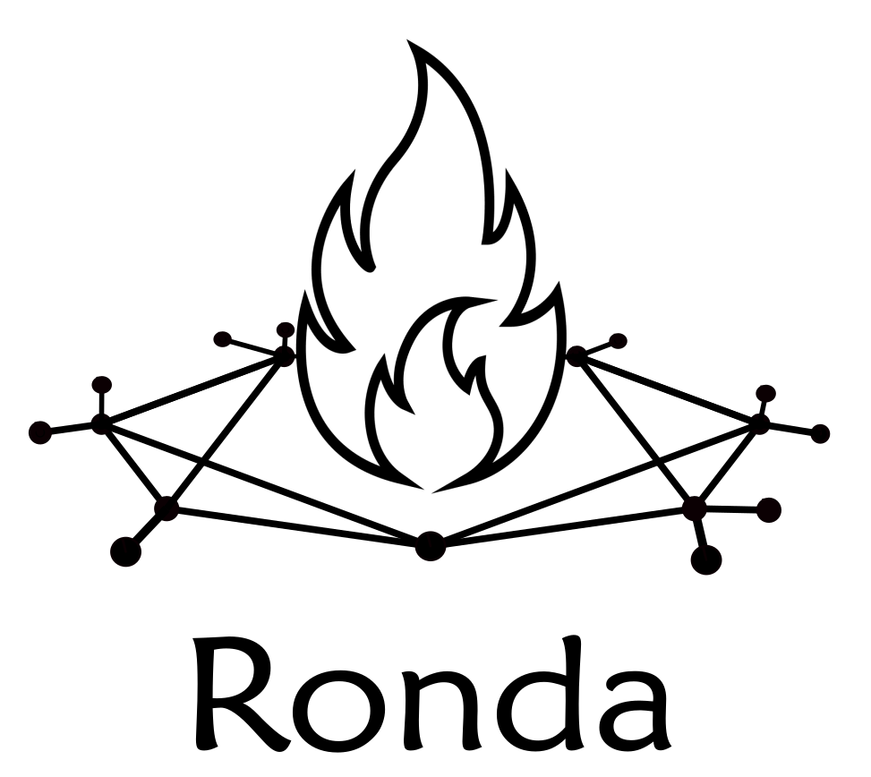

# Ronda de Escritura - Martes 10 de Octubre

La [ronda de escritura](comentarios.md) es un evento virtual en que nos comentamos los textos mutuamente. Tras comentar 3 textos ajenos recibís 3 devoluciones a tu texto.

[Anotate](https://forms.gle/DT8x9hfWcRtJekAq8)

## Cómo participar?

### 1 - Para anotarte, subí el texto con el que vas a participar en [este Form](https://forms.gle/DT8x9hfWcRtJekAq8) hasta el sábado a las 23.

- Extensión **máxima 650 palabras**. No hay mínimo.
- Puede ser poesía, ficción, ensayo o lo que quieras.
- Puede ser un texto viejo o uno que escribas para la ocasión.

### 2 - Desde las 17:00 del Sábado 30 de septiembre te va a llegar un correo con 3 textos para que comentes.

- Es **obligatorio** comentar los 3 textos que te tocan.
- Podés comentarlos **hasta las 23:00 del Martes 10** de octubre.
- Cada comentario tiene una extensión **mínima de 150 palabras**. No hay máximo.
- El comentario puede ser lo que se te ocurra. Desde un análisis del texto hasta un pensamiento que te haya disparado.
- Te va a llegar también la lista de [todos los textos](comentarios.md). Si querés, podés comentar más textos que los asignados.

### 3 - Durante el Miércoles, te va a llegar tu texto junto a 3 comentarios como mínimo.

- También vamos a armar una compaginación con todos los textos que se escribieron.
  
[Por qué Ronda](propuesta.md)

<link rel="shortcut icon" type="image/x-icon" href="favicon.ico">
