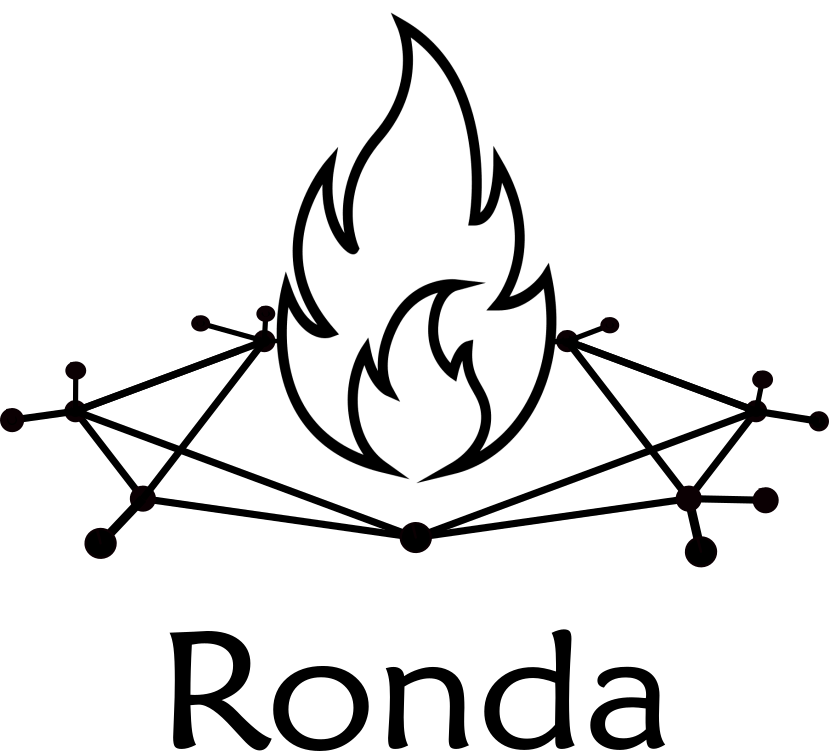

La red se había vuelto  
una sola multitud  
y un solo foco. 

Un espectáculo  
con el precio  
de volvernos **invisibles**.

Ansiedad, depresión,  
sobremedicación.

Un día, el foco se atenuó   
y se multiplicó   
y volvimos a **vernos**.

Se achicó el **escenario**   
y la **escena** floreció.

**Ronda**    
[Participá](actividad.md)

    <a href="actividad.md" style="display: inline-block; padding: 10px 20px; background-color: #007BFF; color: #FFFFFF; text-decoration: none; border: none; border-radius: 4px; transition: background-color 0.3s ease;">Participá</a>

[Participá](actividad.md)

